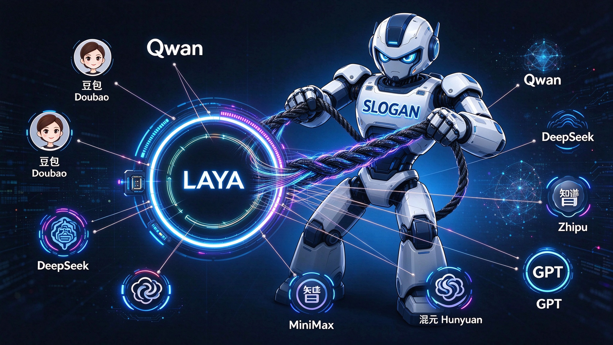

# 千丝傀智

> 一线分两路，双傀各承长



千丝傀智以前端策略为引线，智能区分用户意图，将请求分发到最合适的模型：代码难题交给擅长代码的模型，情感闲谈交给擅长对话的模型。平台支持接入数十种模型，自动发现、能力评估、统一调度、额度可控，是一站式多模型分发网关。

## 产品简介

千丝傀智是一个**多模型 AI 网关**，提供三个入口：

| 入口 | 前缀 | 说明 |
|---|---|---|
| OpenAI 兼容网关 | `/v1` | 数据平面，兼容 OpenAI 协议，内置 Laya 智能路由 |
| 用户平台 | `/user/api/v1` | 账户、API Key、额度、兑换、用量 |
| 管理平台 | `/admin/api/v1` | 供应商、模型、评分、用户、额度、流量包运营 |

核心能力：

- **模型接入**：自动发现 + 手动添加，支持数十种模型接入。
- **模型无关**：不绑定具体模型，由能力画像与路由策略动态选择。
- **能力画像**：统一模板让模型自评/互评，生成结构化能力评分。
- **评分版本**：刷新期间旧评分继续服务，新评分校验后原子切换。
- **智能路由（Laya）**：按请求能力、评分、成本、延迟和管理策略分发。
- **透明转发**：尽量保留原始请求，让后端 cache 生效。
- **额度计费**：统一金额额度、流量包、兑换码、预扣结算、用量成本统计。
- **软删除**：业务实体统一 `deleted_at`，唯一约束为部分唯一索引。

## 文档

### 产品

- [产品需求文档](docs/product-requirements.md)（Product Requirements）

### 设计

- [总体详细设计文档](docs/detailed-design.md)（Detailed Design）
- [OpenAI 兼容网关设计文档](docs/design-openai-gateway.md)（含 Laya 路由引擎设计）
- [用户平台设计文档](docs/design-user-platform.md)
- [管理平台设计文档](docs/design-admin-platform.md)

## 目录结构

```text
.
├── slogan.jpeg                          # 产品形象图
├── README.md
└── docs/                                # 产品与设计文档
    ├── product-requirements.md
    ├── detailed-design.md
    ├── design-openai-gateway.md
    ├── design-user-platform.md
    └── design-admin-platform.md
└── openspec/                            # OpenSpec 变更规划
    ├── config.yaml
    └── changes/build-multi-model-ai-gateway/
        ├── proposal.md
        ├── design.md
        ├── tasks.md
        └── specs/
```

## 产品架构

```text
                         +----------------------+
                         |      管理端后台        |
                         | 供应商/模型/评分/额度  |
                         +----------+-----------+
                                    |
                                    v
                         +----------------------+
                         |       Laya 网关        |
                         | 鉴权/额度/意图/路由    |
                         | 透明转发/流式/计费     |
                         +----------+-----------+
                                    |
              +---------------------+---------------------+
              |                     |                     |
              v                     v                     v
          供应商 A              供应商 B              供应商 C
                                     ^
                         +-----------+-----------+
                         |       用户侧平台       |
                         | API Key/余额/兑换/用量 |
                         +----------------------+
```

## 状态

当前项目处于**设计阶段**：产品需求与三平台详细设计已完成，尚未开始编码实现。
