# 千丝傀智 · 管理平台 设计文档

| 项目 | 内容 |
|---|---|
| 平台 | 管理平台（控制平面） |
| 入口前缀 | `/admin/api/v1` |
| 文档版本 | v1.0 |
| 关联 | `docs/product-requirements.md` |

---

## 1. 整体设计

### 1.1 定位

管理平台是**控制平面**，负责供应商与模型接入、模型评估与评分发布、用户与额度运营、流量包与兑换码、用量与成本统计、路由策略、审计。它通过“评分版本”这一只读快照影响网关的数据平面。

### 1.2 逻辑架构

```text
                        管理员浏览器
                              |
                              v
+---------------------------------------------------------------+
|                      管理平台 (Admin Console)                  |
|  /admin/api/v1/**                                              |
|  - 供应商管理    - 模型管理     - 评分刷新                     |
|  - 用户管理      - 额度运营     - 流量包/兑换码                |
|  - 用量/成本     - 路由策略     - 审计日志                     |
+---------------------------------------------------------------+
                              |
        +---------------------+---------------------+
        v                     v                     v
+----------------+   +------------------+   +------------------+
| ProviderService|   | EvaluationService|   | Quota/User/Usage |
+----------------+   +------------------+   +------------------+
        |                     |                     |
        |             +-------+-------+             |
        |             v               v             |
        |        WorkerPool       score_version     |
        |      (并发评估)          (发布/回滚)       |
        v                     |                     v
+---------------------------------------------------------------+
|  ProviderAdapter  ---->  上游供应商模型（被作为评估者）        |
+---------------------------------------------------------------+
                              |
                              v
             发布评分版本 -> 刷新 Redis 评分快照 -> 网关读取
```

### 1.3 控制平面与数据平面

```text
管理平台                          网关(数据平面)
  |                                    |
  |--发布 score_version(published)--->|  刷新 Redis 评分快照
  |                                    |  用户请求只读 published
  |--启停模型/供应商------------------>|  路由候选集变化
  |--调整用户额度/启停用户------------>|  鉴权/额度校验变化
  |<--网关写 request_log/usage_record-|  统计来源
```

### 1.4 评分版本机制（核心）

```text
building --(成功率达阈值)--> published --(新版本发布)--> superseded
   |                              ^
   +--(失败/低于阈值)--> failed    |
                                 回滚可把历史版本重新置 published
```

- 全局唯一 `published`（DB 唯一索引保证）。
- 发布/回滚在事务内原子完成。
- 刷新期间旧版本继续服务。
- DB 内版本状态切换不等于运行时已生效：所有仍接流量的网关节点 ACK 新快照后才算发布成功（见 §6.7、§9.1）。

### 1.5 设计原则

- RBAC 最小权限，高危操作审计。
- 供应商密钥加密存储、脱敏展示。
- 评估任务独立并发池，限制 token/并发/超时。
- 额度调整走流水，可对账。

---

## 2. 接口设计

统一前缀 `/admin/api/v1`，鉴权：管理员 Token + RBAC。
统一响应包：`{ "code": 0, "message": "ok", "data": {}, "requestId": "..." }`。

权限点：`provider:* model:* evaluation:* user:* quota:* package:* code:* policy:* log:* usage:* audit:*`

### 2.1 供应商

#### 2.1.1 创建

```text
POST /admin/api/v1/providers       权限：provider:create
```

参数：

| 参数 | 类型 | 必填 | 说明 |
|---|---|---|---|
| name | string | 是 | 名称 |
| type | string | 是 | openai_compatible / custom |
| baseUrl | string | 是 | Base URL |
| authType | string | 是 | bearer / custom |
| secret | string | 是 | 密钥（服务端加密） |
| protocol | string | 否 | 默认 openai |
| region | string | 否 | 区域 |

返回：

```json
{ "code": 0, "data": { "id": 12, "name": "DeepSeek", "secretMasked": "sk-****abcd", "status": "enabled" } }
```

错误：40001 / 40002 / 40302 / 40902

#### 2.1.2 列表 / 详情 / 更新 / 删除

```text
GET    /admin/api/v1/providers?page=&pageSize=&keyword=&status=
GET    /admin/api/v1/providers/{id}
PUT    /admin/api/v1/providers/{id}     权限：provider:update
DELETE /admin/api/v1/providers/{id}     权限：provider:delete
```

- 更新时 `secret` 为空表示不改。
- 删除为**软删除**（写入 `deleted_at`），不物理删除。
- 删除前校验是否仍有可用模型，有则 40901。

#### 2.1.3 连通性测试

```text
POST /admin/api/v1/providers/{id}/test
```

返回：`{ "reachable": true, "latencyMs": 320, "modelsDetected": 8 }`
错误：40402 / 50201 / 50202

#### 2.1.4 触发发现

```text
POST /admin/api/v1/providers/{id}/discover
```

返回：`{ "discovered": 8, "added": 5, "updated": 2, "unavailable": 1 }`

### 2.2 模型

```text
GET  /admin/api/v1/models?providerId=&status=&keyword=&page=&pageSize=
POST /admin/api/v1/models                权限：model:create
GET  /admin/api/v1/models/{id}
PUT  /admin/api/v1/models/{id}           权限：model:update
POST /admin/api/v1/models/{id}/enable
POST /admin/api/v1/models/{id}/disable
GET  /admin/api/v1/models/{id}/capabilities
```

手动添加参数：

| 参数 | 类型 | 必填 |
|---|---|---|
| providerId | long | 是 |
| name | string | 是 |
| modelKey | string | 是 |
| contextLength | int | 否 |
| inputModalities | string[] | 否 |
| supportsStream | bool | 否 |
| supportsTools | bool | 否 |
| inputPriceMicro | long | 否 |
| outputPriceMicro | long | 否 |

能力画像返回：

```json
{
  "code": 0,
  "data": {
    "modelId": 3, "scoreVersionId": 7,
    "dimensions": [ { "dimension": "coding", "score": 0.88, "selfScore": 0.9, "peerScore": 0.85, "confidence": 0.72 } ],
    "advantages": ["代码分析较强"],
    "disadvantages": ["情感闲聊一般"]
  }
}
```

错误：40402 / 40403 / 40902

### 2.3 评分刷新

#### 2.3.1 触发

```text
POST /admin/api/v1/evaluation/refresh     权限：evaluation:refresh
```

返回：`{ "taskId": 1001, "scoreVersionId": 8, "status": "running", "total": 40 }`
错误：40903（已有刷新进行中）/ 40302

#### 2.3.2 进度

```text
GET /admin/api/v1/evaluation/refresh/{taskId}
```

返回：

```json
{
  "code": 0,
  "data": {
    "taskId": 1001, "status": "running",
    "total": 40, "succeeded": 37, "failed": 2, "pending": 1,
    "items": [ { "modelId": 3, "status": "succeeded" }, { "modelId": 4, "status": "timeout" } ]
  }
}
```

#### 2.3.3 版本列表 / 发布 / 回滚

```text
GET  /admin/api/v1/evaluation/versions
POST /admin/api/v1/evaluation/versions/{id}/publish    权限：evaluation:publish
POST /admin/api/v1/evaluation/versions/{id}/rollback   权限：evaluation:publish
```

- 发布校验 `successRatio >= minPublishRatio`，否则 40905。
- 发布/回滚事务内切换，旧 `published` 置 `superseded`。

### 2.4 用户与额度

```text
GET  /admin/api/v1/users?keyword=&status=&page=&pageSize=
GET  /admin/api/v1/users/{id}
POST /admin/api/v1/users/{id}/disable
POST /admin/api/v1/users/{id}/enable
POST /admin/api/v1/users/{id}/quota/adjust   权限：quota:adjust
```

调整额度参数：

| 参数 | 类型 | 必填 | 说明 |
|---|---|---|---|
| amountMicro | long | 是 | 正负均可 |
| remark | string | 否 | 备注 |
| idempotencyKey | string | 否 | 幂等键 |

错误：40302 / 40404 / 40001

### 2.5 用量与成本

```text
GET /admin/api/v1/usage/models?from=&to=&providerId=&modelId=
GET /admin/api/v1/usage/users?from=&to=&userId=
GET /admin/api/v1/usage/cost?from=&to=&groupBy=model|user|provider
```

返回示例：

```json
{
  "code": 0,
  "data": { "list": [ {
    "modelId": 3, "requests": 1200, "inputTokens": 500000, "outputTokens": 320000,
    "costMicro": 1200000, "chargeMicro": 2400000, "successRate": 0.998, "avgLatencyMs": 840
  } ] }
}
```

### 2.6 流量包与兑换码

```text
POST /admin/api/v1/quota-packages              权限：package:create
GET  /admin/api/v1/quota-packages
POST /admin/api/v1/quota-packages/{id}/codes   权限：code:generate
GET  /admin/api/v1/redemption-codes?batchId=&status=&page=
```

创建流量包参数：

| 参数 | 类型 | 必填 |
|---|---|---|
| name | string | 是 |
| faceValueMicro | long | 是 |
| validDays | int | 否 |
| modelScope | string[] | 否 |
| allowAutoRoute | bool | 否 |

> 首版口径：`validDays`、`modelScope`、`allowAutoRoute` 为**预留字段**，接口可接受但当前不生效。兑换统一进入全局余额、不区分模型、兑换后不单独过期（见 PRD 第 12 节、`docs/design-user-platform.md` 第 9 节）；schema 列保留为后续版本兼容。

生成兑换码参数：

| 参数 | 类型 | 必填 | 说明 |
|---|---|---|---|
| quantity | int | 是 | 上限可配置 |
| expiresAt | string | 否 | 统一过期 |
| remark | string | 否 | |

返回：`{ "batchId": 55, "quantity": 100, "codes": ["QZ-XXXX-0001"] }`
错误：40405 / 40001 / 40302

### 2.7 路由策略

```text
GET /admin/api/v1/routing-policy
PUT /admin/api/v1/routing-policy     权限：policy:update
```

参数：

| 参数 | 类型 | 范围 | 说明 |
|---|---|---|---|
| lowCapabilityBias | int | 0-100 | 低成本/低能力倾向 |
| minPublishRatio | number | 0-1 | 默认 0.80 |
| highRiskForceQuality | bool | | 高风险强制质量优先 |
| evalMaxTokens | int | | 默认 2000 |
| evalConcurrency | int | | 默认 5 |
| contentLogEnabled | bool | | 默认 false |
| contentLogRetentionDays | int | | 默认 7 |

### 2.8 审计日志

```text
GET /admin/api/v1/audit-logs?actorType=&action=&from=&to=&page=
```

---

## 3. 统一错误码

| 错误码 | 常量 | HTTP | 说明 |
|---|---|---|---|
| 0 | OK | 200 | 成功 |
| 40001 | INVALID_PARAM | 400 | 参数非法 |
| 40002 | MISSING_PARAM | 400 | 缺少必填参数 |
| 40101 | UNAUTHENTICATED | 401 | 未登录 |
| 40102 | TOKEN_EXPIRED | 401 | 凭证过期 |
| 40301 | FORBIDDEN | 403 | 无权限 |
| 40302 | ROLE_DENIED | 403 | 角色权限不足 |
| 40402 | PROVIDER_NOT_FOUND | 404 | 供应商不存在 |
| 40403 | MODEL_NOT_FOUND | 404 | 模型不存在 |
| 40404 | USER_NOT_FOUND | 404 | 用户不存在 |
| 40405 | PACKAGE_NOT_FOUND | 404 | 流量包不存在 |
| 40901 | STATE_CONFLICT | 409 | 状态冲突 |
| 40902 | DUPLICATE | 409 | 重复创建 |
| 40903 | REFRESH_RUNNING | 409 | 已有刷新进行中 |
| 40905 | SCORE_VERSION_NOT_PUBLISHABLE | 409 | 评分版本不可发布 |
| 42901 | RATE_LIMITED | 429 | 触发限流 |
| 50001 | INTERNAL_ERROR | 500 | 内部错误 |
| 50201 | PROVIDER_ERROR | 502 | 供应商错误 |
| 50202 | PROVIDER_TIMEOUT | 504 | 供应商超时 |
| 50301 | SERVICE_UNAVAILABLE | 503 | 服务不可用 |

---

## 4. 表结构定义

### 4.1 管理平台依赖表

> 业务实体表使用 `deleted_at TIMESTAMPTZ` 软删除；唯一约束（含联合唯一）改为带 `WHERE deleted_at IS NULL` 的部分唯一索引。追加型/账务/日志表不软删除。

```text
admin_user  role  admin_user_role     身份与权限
provider  model                       供应商与模型
score_version  model_capability       评分版本与能力矩阵
model_evaluation                      评估原始记录
refresh_task  refresh_task_item       刷新任务
app_user  quota_account  quota_ledger 用户与额度运营
quota_package  redemption_code_batch  redemption_code
routing_policy                        路由策略
audit_log                             审计
request_log  usage_record             统计来源
```

### 4.2 关键字段

#### provider

| 字段 | 类型 | 说明 |
|---|---|---|
| id | bigserial | 主键 |
| name | varchar(128) | 名称 |
| type | varchar(32) | openai_compatible/custom |
| base_url | varchar(512) | Base URL |
| auth_type | varchar(32) | bearer/custom |
| secret_cipher | text | 加密密钥 |
| protocol | varchar(32) | |
| region | varchar(64) | |
| status | varchar(16) | enabled/disabled |
| created_at / updated_at | timestamptz | |
| deleted_at | timestamptz | 软删除，NULL 表示未删除 |

#### model

| 字段 | 类型 | 说明 |
|---|---|---|
| id | bigserial | 主键 |
| provider_id | bigint | 供应商 |
| name | varchar(128) | 展示名 |
| model_key | varchar(128) | 供应商侧标识 |
| context_length | integer | |
| input_modalities | jsonb | |
| supports_stream | boolean | |
| supports_tools | boolean | |
| input_price_micro | bigint | |
| output_price_micro | bigint | |
| source | varchar(16) | discovered/manual |
| status | varchar(16) | |
| created_at / updated_at | timestamptz | |
| deleted_at | timestamptz | 软删除，NULL 表示未删除 |

部分唯一索引（联合唯一 + 软删条件）：`(provider_id, model_key) WHERE deleted_at IS NULL`

#### score_version

| 字段 | 类型 | 说明 |
|---|---|---|
| id | bigserial | 主键 |
| status | varchar(16) | building/published/superseded/failed |
| success_ratio | numeric(5,4) | |
| total_models | integer | |
| valid_models | integer | |
| template_version | varchar(32) | |
| rule_version | varchar(32) | |
| created_at / published_at | timestamptz | |

#### model_capability

| 字段 | 类型 | 说明 |
|---|---|---|
| id | bigserial | 主键 |
| score_version_id | bigint | |
| model_id | bigint | |
| dimension | varchar(32) | |
| score / self_score / peer_score / confidence | numeric(5,4) | |

唯一：`(score_version_id, model_id, dimension)`

#### model_evaluation

| 字段 | 类型 | 说明 |
|---|---|---|
| id | bigserial | 主键 |
| refresh_task_id | bigint | |
| evaluator_model_id | bigint | 评估者 |
| target_model_id | bigint | 被评估者 |
| dimension | varchar(32) | |
| score / confidence / weight | numeric(5,4) | |
| advantages / disadvantages / recommended_tasks / not_recommended_tasks | jsonb | |
| raw_output | jsonb | |
| created_at | timestamptz | |

#### refresh_task / refresh_task_item

| 表 | 关键字段 |
|---|---|
| refresh_task | id, score_version_id, status, total, succeeded, failed, created_by, created_at, finished_at |
| refresh_task_item | id, task_id, model_id, status, error_message, started_at, finished_at |

#### routing_policy

| 字段 | 类型 | 默认 |
|---|---|---|
| low_capability_bias | integer | 50 |
| min_publish_ratio | numeric(5,4) | 0.80 |
| high_risk_force_quality | boolean | true |
| eval_max_tokens | integer | 2000 |
| eval_concurrency | integer | 5 |
| eval_timeout_seconds | integer | 60 |
| content_log_enabled | boolean | false |
| content_log_retention_days | integer | 7 |

#### audit_log

| 字段 | 类型 | 说明 |
|---|---|---|
| id | bigserial | 主键 |
| actor_type | varchar(16) | admin/user/system |
| actor_id | bigint | |
| action | varchar(64) | |
| target_type | varchar(32) | |
| target_id | varchar(64) | |
| detail | jsonb | 脱敏 |
| ip | varchar(64) | |
| created_at | timestamptz | |

---

## 5. 初始化 SQL

```sql
-- 管理平台依赖核心表（完整库结构见总设计文档）
CREATE TABLE admin_user (
    id            BIGSERIAL PRIMARY KEY,
    username      VARCHAR(64)  NOT NULL,
    display_name  VARCHAR(128) NOT NULL DEFAULT '',
    password_hash VARCHAR(255) NOT NULL,
    status        VARCHAR(16)  NOT NULL DEFAULT 'active',
    created_at    TIMESTAMPTZ  NOT NULL DEFAULT now(),
    updated_at    TIMESTAMPTZ  NOT NULL DEFAULT now(),
    deleted_at    TIMESTAMPTZ
);
CREATE UNIQUE INDEX uq_admin_user_username ON admin_user(username) WHERE deleted_at IS NULL;

CREATE TABLE role (
    id          BIGSERIAL PRIMARY KEY,
    code        VARCHAR(64) NOT NULL,
    name        VARCHAR(128) NOT NULL,
    permissions JSONB NOT NULL DEFAULT '[]'::jsonb,
    created_at  TIMESTAMPTZ NOT NULL DEFAULT now(),
    deleted_at  TIMESTAMPTZ
);
CREATE UNIQUE INDEX uq_role_code ON role(code) WHERE deleted_at IS NULL;

CREATE TABLE admin_user_role (
    id            BIGSERIAL PRIMARY KEY,
    admin_user_id BIGINT NOT NULL REFERENCES admin_user(id) ON DELETE CASCADE,
    role_id       BIGINT NOT NULL REFERENCES role(id) ON DELETE CASCADE,
    UNIQUE (admin_user_id, role_id)
);

CREATE TABLE provider (
    id            BIGSERIAL PRIMARY KEY,
    name          VARCHAR(128) NOT NULL,
    type          VARCHAR(32)  NOT NULL DEFAULT 'openai_compatible',
    base_url      VARCHAR(512) NOT NULL,
    auth_type     VARCHAR(32)  NOT NULL DEFAULT 'bearer',
    secret_cipher TEXT,
    protocol      VARCHAR(32)  NOT NULL DEFAULT 'openai',
    region        VARCHAR(64)  NOT NULL DEFAULT '',
    status        VARCHAR(16)  NOT NULL DEFAULT 'enabled',
    created_at    TIMESTAMPTZ  NOT NULL DEFAULT now(),
    updated_at    TIMESTAMPTZ  NOT NULL DEFAULT now(),
    deleted_at    TIMESTAMPTZ
);

CREATE TABLE model (
    id                 BIGSERIAL PRIMARY KEY,
    provider_id        BIGINT NOT NULL REFERENCES provider(id) ON DELETE CASCADE,
    name               VARCHAR(128) NOT NULL,
    model_key          VARCHAR(128) NOT NULL,
    context_length     INTEGER,
    input_modalities   JSONB NOT NULL DEFAULT '["text"]'::jsonb,
    supports_stream    BOOLEAN NOT NULL DEFAULT true,
    supports_tools     BOOLEAN NOT NULL DEFAULT false,
    input_price_micro  BIGINT NOT NULL DEFAULT 0,
    output_price_micro BIGINT NOT NULL DEFAULT 0,
    source             VARCHAR(16) NOT NULL DEFAULT 'manual',
    status             VARCHAR(16) NOT NULL DEFAULT 'available',
    created_at         TIMESTAMPTZ NOT NULL DEFAULT now(),
    updated_at         TIMESTAMPTZ NOT NULL DEFAULT now(),
    deleted_at         TIMESTAMPTZ
);
CREATE UNIQUE INDEX uq_model_provider_key
    ON model(provider_id, model_key) WHERE deleted_at IS NULL;
CREATE INDEX idx_model_status ON model(status);

CREATE TABLE score_version (
    id               BIGSERIAL PRIMARY KEY,
    status           VARCHAR(16) NOT NULL DEFAULT 'building',
    success_ratio    NUMERIC(5,4) NOT NULL DEFAULT 0,
    total_models     INTEGER NOT NULL DEFAULT 0,
    valid_models     INTEGER NOT NULL DEFAULT 0,
    template_version VARCHAR(32) NOT NULL DEFAULT 'v1',
    rule_version     VARCHAR(32) NOT NULL DEFAULT 'v1',
    created_at       TIMESTAMPTZ NOT NULL DEFAULT now(),
    published_at     TIMESTAMPTZ
);
CREATE UNIQUE INDEX uq_score_version_published
    ON score_version((status)) WHERE status = 'published';

CREATE TABLE model_capability (
    id               BIGSERIAL PRIMARY KEY,
    score_version_id BIGINT NOT NULL REFERENCES score_version(id) ON DELETE CASCADE,
    model_id         BIGINT NOT NULL REFERENCES model(id) ON DELETE CASCADE,
    dimension        VARCHAR(32) NOT NULL,
    score            NUMERIC(5,4) NOT NULL DEFAULT 0,
    self_score       NUMERIC(5,4) NOT NULL DEFAULT 0,
    peer_score       NUMERIC(5,4) NOT NULL DEFAULT 0,
    confidence       NUMERIC(5,4) NOT NULL DEFAULT 0,
    UNIQUE (score_version_id, model_id, dimension)
);

CREATE TABLE model_evaluation (
    id                    BIGSERIAL PRIMARY KEY,
    refresh_task_id       BIGINT,
    evaluator_model_id    BIGINT NOT NULL REFERENCES model(id) ON DELETE CASCADE,
    target_model_id       BIGINT NOT NULL REFERENCES model(id) ON DELETE CASCADE,
    dimension             VARCHAR(32) NOT NULL,
    score                 NUMERIC(5,4) NOT NULL DEFAULT 0,
    confidence            NUMERIC(5,4) NOT NULL DEFAULT 0,
    advantages            JSONB,
    disadvantages         JSONB,
    recommended_tasks     JSONB,
    not_recommended_tasks JSONB,
    raw_output            JSONB,
    weight                NUMERIC(5,4) NOT NULL DEFAULT 0,
    created_at            TIMESTAMPTZ NOT NULL DEFAULT now()
);
CREATE INDEX idx_eval_task ON model_evaluation(refresh_task_id);

CREATE TABLE refresh_task (
    id               BIGSERIAL PRIMARY KEY,
    score_version_id BIGINT REFERENCES score_version(id),
    status           VARCHAR(16) NOT NULL DEFAULT 'running',
    total            INTEGER NOT NULL DEFAULT 0,
    succeeded        INTEGER NOT NULL DEFAULT 0,
    failed           INTEGER NOT NULL DEFAULT 0,
    created_by       BIGINT REFERENCES admin_user(id),
    created_at       TIMESTAMPTZ NOT NULL DEFAULT now(),
    finished_at      TIMESTAMPTZ
);

CREATE TABLE refresh_task_item (
    id            BIGSERIAL PRIMARY KEY,
    task_id       BIGINT NOT NULL REFERENCES refresh_task(id) ON DELETE CASCADE,
    model_id      BIGINT NOT NULL REFERENCES model(id) ON DELETE CASCADE,
    status        VARCHAR(24) NOT NULL DEFAULT 'pending',
    error_message TEXT,
    started_at    TIMESTAMPTZ,
    finished_at   TIMESTAMPTZ
);
CREATE INDEX idx_refresh_item_task ON refresh_task_item(task_id);

CREATE TABLE quota_package (
    id               BIGSERIAL PRIMARY KEY,
    name             VARCHAR(128) NOT NULL,
    face_value_micro BIGINT NOT NULL,
    valid_days       INTEGER,
    model_scope      JSONB,
    allow_auto_route BOOLEAN NOT NULL DEFAULT true,
    status           VARCHAR(16) NOT NULL DEFAULT 'active',
    created_at       TIMESTAMPTZ NOT NULL DEFAULT now(),
    deleted_at       TIMESTAMPTZ
);

CREATE TABLE redemption_code_batch (
    id         BIGSERIAL PRIMARY KEY,
    package_id BIGINT NOT NULL REFERENCES quota_package(id),
    quantity   INTEGER NOT NULL,
    created_by BIGINT REFERENCES admin_user(id),
    remark     VARCHAR(255) NOT NULL DEFAULT '',
    created_at TIMESTAMPTZ NOT NULL DEFAULT now(),
    deleted_at TIMESTAMPTZ
);

CREATE TABLE redemption_code (
    id          BIGSERIAL PRIMARY KEY,
    batch_id    BIGINT NOT NULL REFERENCES redemption_code_batch(id) ON DELETE CASCADE,
    package_id  BIGINT NOT NULL REFERENCES quota_package(id),
    code_hash   VARCHAR(64) NOT NULL,
    code_prefix VARCHAR(16) NOT NULL,
    status      VARCHAR(16) NOT NULL DEFAULT 'unused',
    redeemed_by BIGINT,
    redeemed_at TIMESTAMPTZ,
    expires_at  TIMESTAMPTZ,
    created_at  TIMESTAMPTZ NOT NULL DEFAULT now(),
    deleted_at  TIMESTAMPTZ
);
CREATE UNIQUE INDEX uq_redemption_code_hash ON redemption_code(code_hash) WHERE deleted_at IS NULL;
CREATE INDEX idx_code_status ON redemption_code(status);

CREATE TABLE routing_policy (
    id                     BIGSERIAL PRIMARY KEY,
    low_capability_bias    INTEGER NOT NULL DEFAULT 50,
    min_publish_ratio      NUMERIC(5,4) NOT NULL DEFAULT 0.80,
    high_risk_force_quality BOOLEAN NOT NULL DEFAULT true,
    eval_max_tokens        INTEGER NOT NULL DEFAULT 2000,
    eval_concurrency       INTEGER NOT NULL DEFAULT 5,
    eval_timeout_seconds   INTEGER NOT NULL DEFAULT 60,
    content_log_enabled    BOOLEAN NOT NULL DEFAULT false,
    content_log_retention_days INTEGER NOT NULL DEFAULT 7,
    updated_by             BIGINT REFERENCES admin_user(id),
    updated_at             TIMESTAMPTZ NOT NULL DEFAULT now()
);

CREATE TABLE audit_log (
    id          BIGSERIAL PRIMARY KEY,
    actor_type  VARCHAR(16) NOT NULL,
    actor_id    BIGINT,
    action      VARCHAR(64) NOT NULL,
    target_type VARCHAR(32),
    target_id   VARCHAR(64),
    detail      JSONB,
    ip          VARCHAR(64),
    created_at  TIMESTAMPTZ NOT NULL DEFAULT now()
);
CREATE INDEX idx_audit_time ON audit_log(created_at);

-- 初始化数据
INSERT INTO role (code, name, permissions) VALUES
 ('super_admin','超级管理员','["*"]'),
 ('model_admin','模型管理员','["provider:*","model:*","evaluation:*"]'),
 ('user_admin','用户管理员','["user:*","apikey:*"]'),
 ('quota_admin','额度管理员','["quota:*","package:*","code:*"]'),
 ('auditor','审计员','["log:read","usage:read","audit:read"]');

INSERT INTO routing_policy (id) VALUES (1);
```

---

## 6. 逐接口详细时序

> 时序图使用 Mermaid sequenceDiagram。

### 6.1 创建供应商

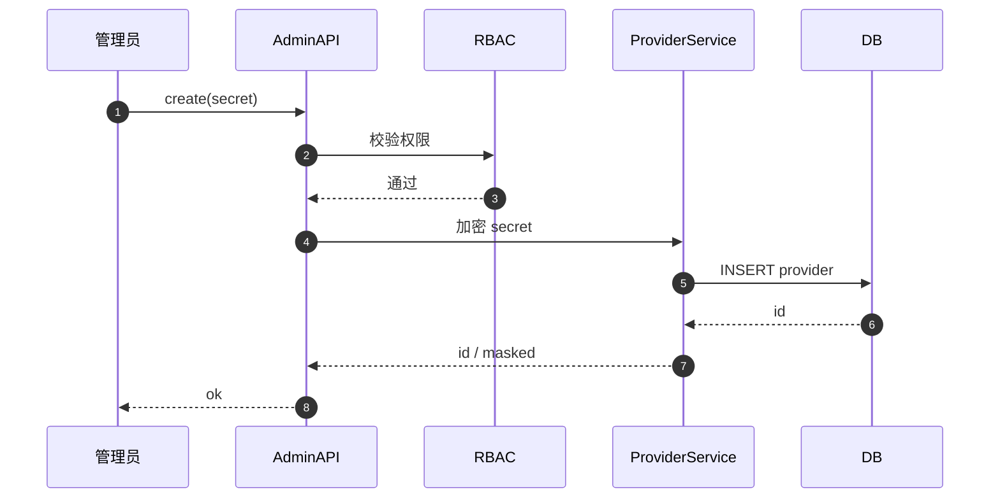

### 6.2 连通性测试

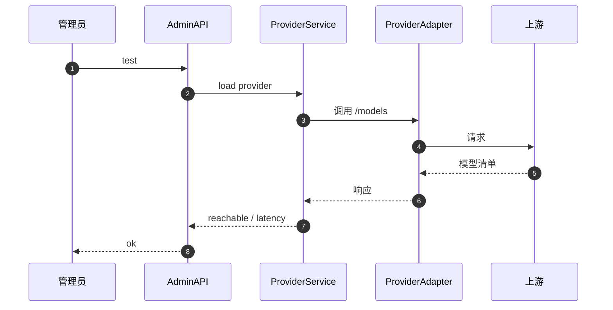

### 6.3 模型发现

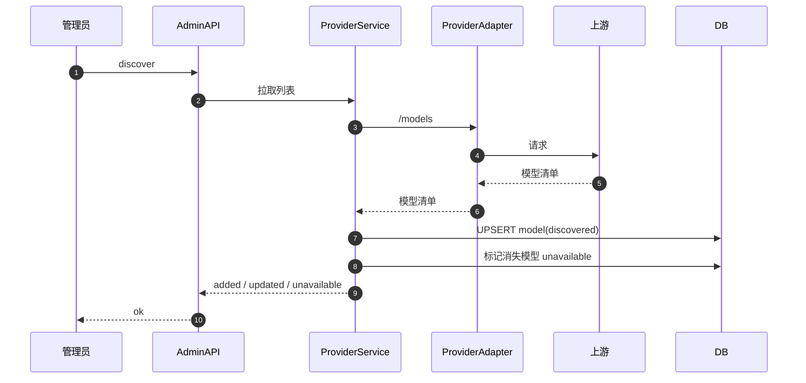

### 6.4 手动添加模型

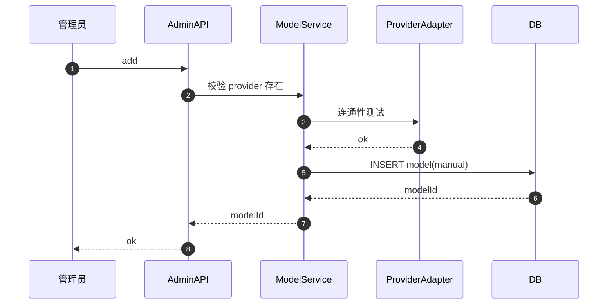

### 6.5 触发评分刷新

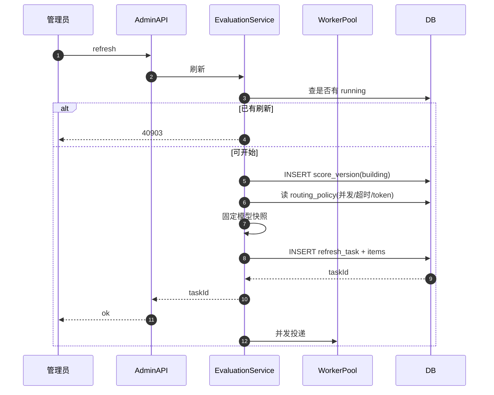

### 6.6 评估任务执行（worker）

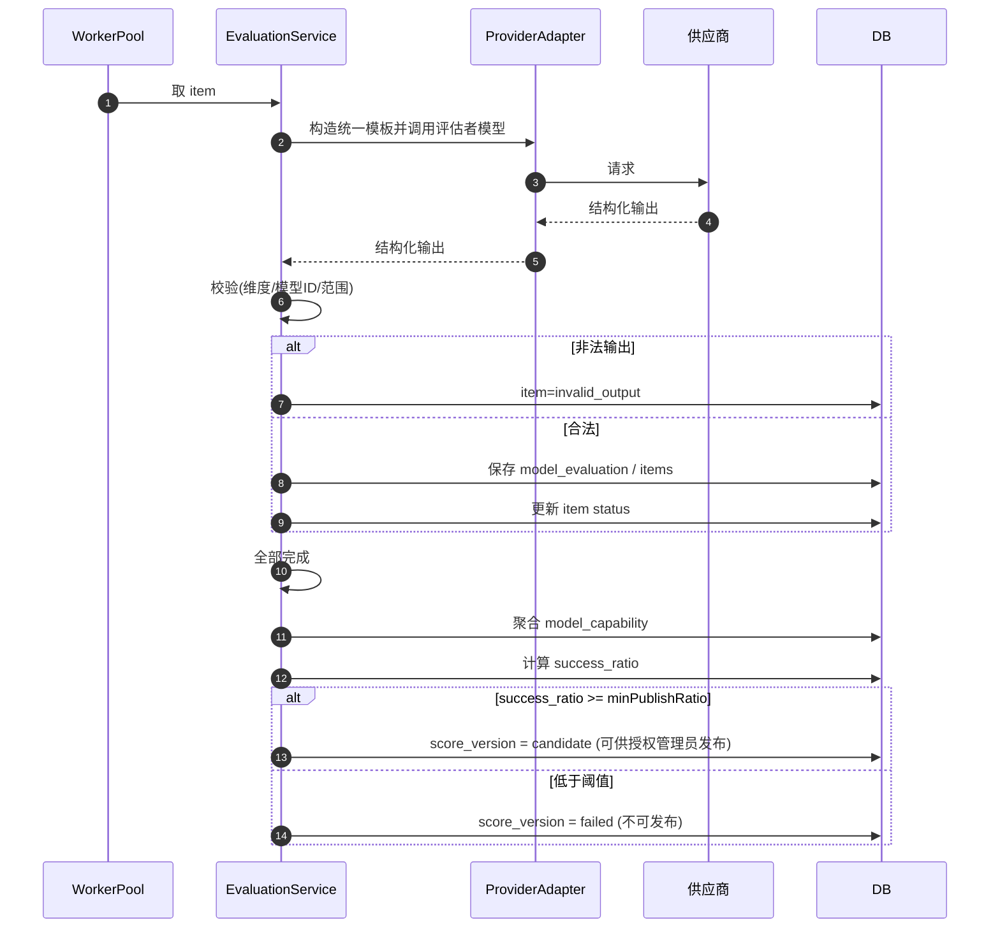

### 6.7 评分发布 / 回滚

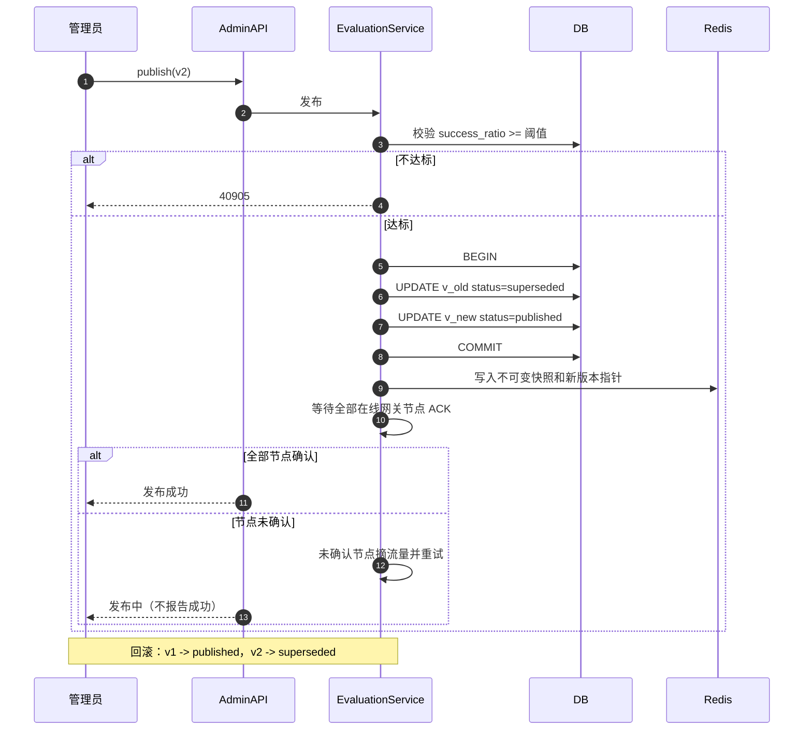

### 6.8 调整用户额度

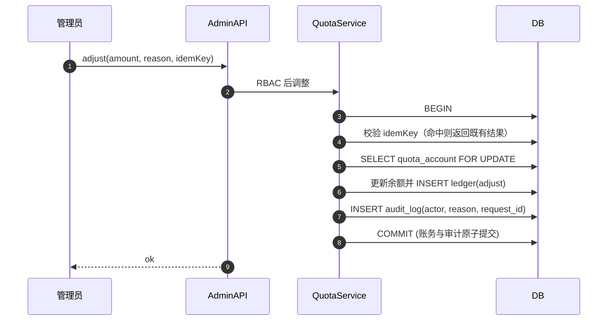

### 6.9 创建流量包并生成兑换码

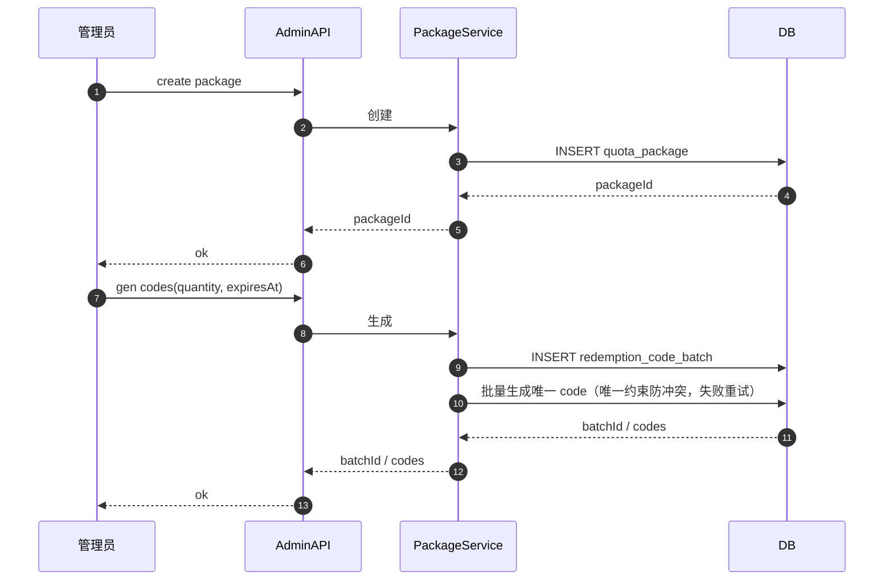

### 6.10 权限不足

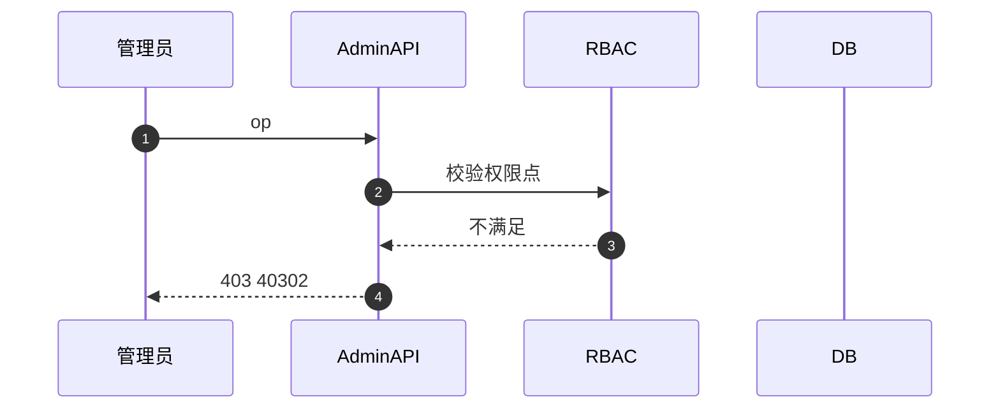

---

## 7. 与 Go 网关的交互（配置与观测）

管理平台作为控制平面，通过“配置”与“观测”两个方向与 Go 网关交互。

### 7.1 Go 网关消费管理平台的产出

| 管理平台产出 | 存储 | Go 网关用途 |
|---|---|---|
| score_version(published) + model_capability | DB / Redis 快照 | 路由评分 |
| routing_policy | DB | low_capability_bias、high_risk_force_quality |
| model.status / provider.status | DB | 候选模型集合 |
| model 元数据（价格/上下文/模态/工具） | DB | 硬约束过滤与成本评分 |

### 7.2 管理平台观测 Go 网关的产出

| Go 网关产出 | 存储 | 管理平台用途 |
|---|---|---|
| route_decision | DB | 查看路由依据、候选排名（内部可见） |
| request_log | DB | 请求级用量、错误、延迟 |
| usage_record | DB | 模型/用户/供应商用量与成本统计 |

### 7.3 交互时序

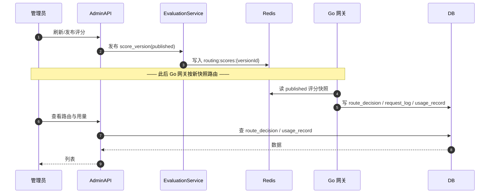

### 7.4 边界

- 管理平台**只配置不执行**：不参与单次请求的路由与转发。
- Go 网关的评分、候选排名、倾向值在管理端可见，对普通用户不可见。
- 评分发布是控制平面影响数据平面的版本切换点：新快照发布后，所有仍接流量的网关节点 ACK 才算成功；未确认节点摘流量，在途请求允许使用旧版本完成。

---

## 8. 附录

### 8.1 权限点

```text
provider:create/update/delete/read
model:create/update/read
evaluation:refresh/publish/read
user:read/enable/disable
quota:adjust/read
package:create/read
code:generate/read
policy:update/read
usage:read
audit:read
log:read
```

### 8.2 状态枚举

```text
provider.status     : enabled/disabled
model.status        : discovering/evaluating/available/unavailable/disabled/eval_failed
model.source        : discovered/manual
score_version.status: building/published/superseded/failed
refresh_task.status : running/published/failed/cancelled
refresh_task_item.status: pending/running/succeeded/timeout/rate_limited/invalid_output/unavailable/cancelled
redemption_code.status  : unused/used/expired
```

### 8.3 安全与审计

- 供应商密钥加密存储（AES-GCM 等），界面与日志脱敏。
- 所有高危操作写 `audit_log`，`detail` 字段脱敏。
- RBAC 最小权限，越权返回 40302。
- 评估任务限制 token/并发/超时，避免账单失控。

---

## 9. 闭环补充约定

### 9.1 评分刷新、发布与回滚

- 刷新任务只产生候选版本；覆盖率达到 80% 不代表自动上线。具备评分发布权限的管理员显式发布，低于阈值拒绝发布。
- 覆盖率分子为本次通过结构校验的新评分模型数，分母为开始时冻结的启用参与模型数；历史分数回退不计入分子。没有历史分数的新模型不进入自动路由。
- 发布采用多节点确认屏障：不可变快照和版本指针写入后，所有仍接流量的网关节点必须 ACK 已加载新版本，才向管理员报告成功。未确认节点先摘流量并重试；在途请求允许用旧版本完成。新节点加入负载均衡前必须加载当前 published 版本。回滚复用该流程并审计操作者、原因和版本。

### 9.2 额度、审计与限流

额度调整、兑换码批量生成、供应商凭证变更、权限变更、评分发布/回滚必须有幂等保护（适用时）、操作者、原因、请求 ID 与不可变审计记录。审计写入失败不得重复执行账务操作；高危操作在审计无法保证时拒绝提交。

限流策略至少含全局、用户、Key、供应商和模型维度，超限返回 429 与 `Retry-After`；限流后端不可用时 fail-closed。RBAC 授权需在服务端逐请求校验，不能仅依赖界面隐藏按钮。

用户认证/Key 及账务边界遵循 PRD 第 12 节和 OpenSpec `design.md` 的 Closure Decisions；管理端不得暴露完整供应商密钥或用户 API Key。
