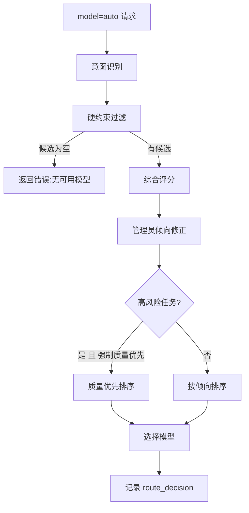
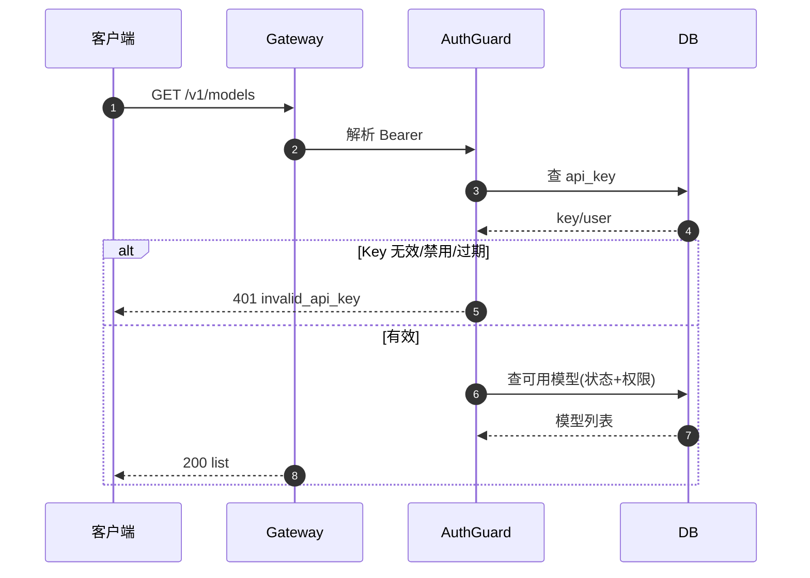
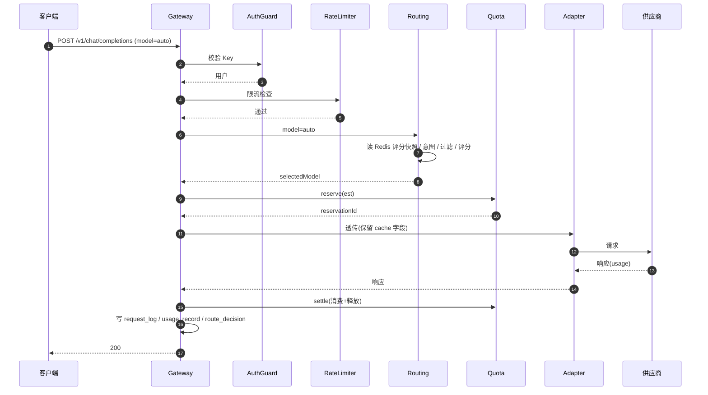
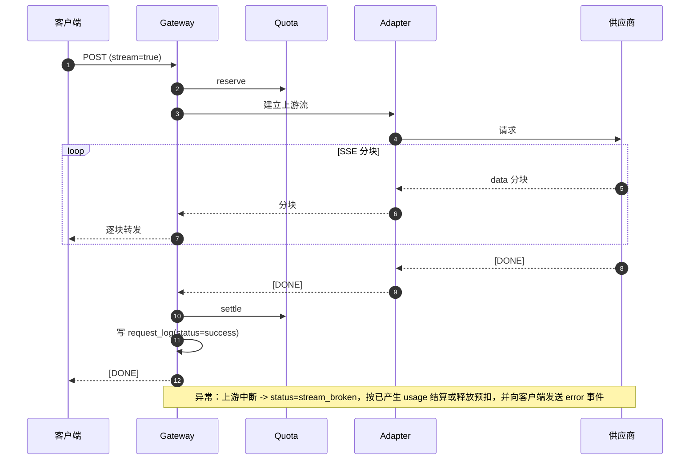
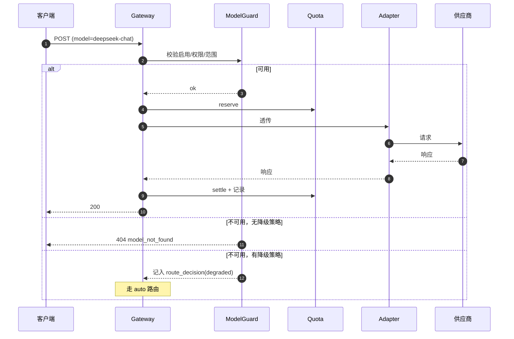
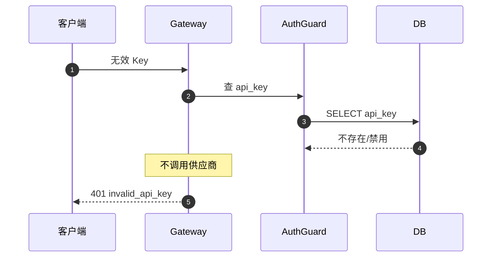
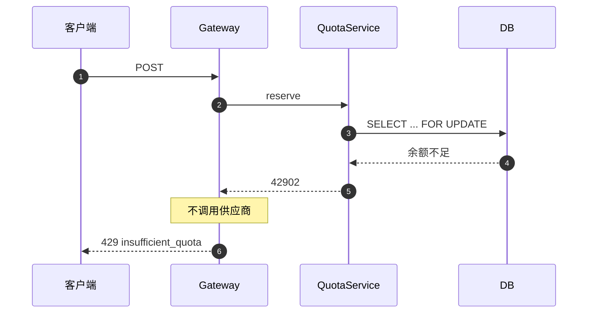
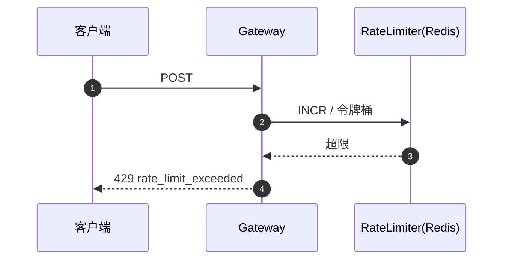

# 千丝傀智 · OpenAI 兼容网关 设计文档

| 项目 | 内容 |
|---|---|
| 平台 | OpenAI 兼容网关（数据平面） |
| 入口前缀 | `/v1` |
| 文档版本 | v1.0 |
| 关联 | `docs/product-requirements.md` |

---

## 1. 整体设计

### 1.1 定位

网关是用户请求的**数据平面**，提供 OpenAI 兼容接口，完成鉴权、限流、额度预扣、模型路由、透明转发、流式代理、用量采集与结算。

### 1.2 逻辑架构

```text
                    用户客户端 (OpenAI SDK / Cursor / 自研)
                                  |
                                  v
+---------------------------------------------------------------+
|                      OpenAI 兼容接入层                         |
|  GET /v1/models         POST /v1/chat/completions             |
+---------------------------------------------------------------+
                                  |
        +-------------------------+-------------------------+
        v                         v                         v
+----------------+      +------------------+      +----------------+
| AuthGuard      |      | RateLimiter      |      | QuotaGuard     |
| API Key 鉴权   |      | 多级限流         |      | 预扣/结算      |
+----------------+      +------------------+      +----------------+
                                  |
                                  v
+---------------------------------------------------------------+
|                    RoutingService (auto)                       |
|  意图识别 -> 硬约束过滤 -> 综合评分 -> 选择模型                 |
|  数据来源：Redis 中的 published 评分快照                        |
+---------------------------------------------------------------+
                                  |
                                  v
+---------------------------------------------------------------+
|                    ProviderAdapter                             |
|  协议适配 / 原始请求透传 / 缓存字段保留 / 流式转发              |
+---------------------------------------------------------------+
                                  |
                                  v
                          上游供应商模型
                                  |
                                  v
+---------------------------------------------------------------+
|  UsageCollector -> Settlement -> request_log / usage_record    |
+---------------------------------------------------------------+
```

### 1.3 设计原则

- 网关无状态，可水平扩展；状态在 DB/Redis。
- 只读 `published` 评分快照，评分刷新不阻塞请求。
- 请求尽量原样透传，保留供应商缓存字段。
- 所有上游调用前完成鉴权、限流、额度校验。
- 错误格式遵循 OpenAI，保证客户端兼容。

### 1.4 依赖的评分快照

```text
Redis 键：routing:scores:{scoreVersionId}
Value   ：能力矩阵 (modelId -> {dimension -> score})
来源    ：管理平台发布评分版本时写入
TTL     ：发布时刷新；长时间未刷新可回源 DB
```

---

## 2. Laya 路由引擎设计

Laya 是网关的分发核心。当请求 `model=auto` 时，Laya 负责把请求路由到当前最合适的模型。它不是简单的关键词映射，而是一个“读取评分快照 + 过滤 + 评分 + 策略修正”的决策流水线。

### 2.1 设计目标

- 不硬编码具体模型：新增模型不需改路由代码。
- 可解释：每次路由都能说明“为什么选它、为什么排除别人”。
- 不阻断：评分刷新期间仍能服务，失败时降级可控。
- 用户不可见内部策略：评分、候选排名、倾向值不返回给用户。

### 2.2 数据来源

Laya 的决策只依赖以下只读输入：

```text
评分快照 (published score_version)
  └─ model_capability: 每个模型的维度分数/置信度
模型元数据 (model)
  ├─ context_length
  ├─ input_modalities
  ├─ supports_stream / supports_tools
  ├─ input_price_micro / output_price_micro
  └─ status
路由策略 (routing_policy)
  ├─ low_capability_bias
  ├─ high_risk_force_quality
  └─ 相关阈值
运行时数据
  └─ 各模型近期延迟/错误率(可选，来自 usage_record)
```

Laya 不依赖任何“硬编码的模型名到任务类型”的映射。

### 2.3 评分快照与版本

```text
管理平台发布 score_version(published)
            |
            v
  写入 Redis: routing:scores:{versionId}
            |
            v
  Laya 读取当前 published 版本（带本地短 TTL 缓存）
```

- Laya 只读 `published`，不读 `building`。
- 评分刷新期间，Laya 继续用旧快照；新版本发布后才切换。
- 若 Redis 缓存缺失，回源查 DB 的能力矩阵。

### 2.4 路由流水线



### 2.5 意图识别

目标：把请求转换为“能力需求”，而不是“目标模型”。

```text
请求内容
   |
   +--> 规则层（优先，低成本、低延迟、不泄露内容）
   |      ├─ 是否含代码块/报错堆栈/SQL/日志
   |      ├─ 是否含技术/情感/闲聊特征
   |      └─ 请求字段（tools 是否存在、是否需多模态）
   |
   +--> 分类器层（兜底，规则不确定时才调用路由模型）
          └─ 输出 intent + requiredCapabilities + 置信度
```

输出结构（示例）：

```json
{
  "intent": "coding",
  "requiredCapabilities": { "coding": 0.80, "reasoning": 0.75 },
  "needsTools": false,
  "needsVision": false,
  "highRisk": false,
  "confidence": 0.86
}
```

- 规则能明确判断时，直接得到能力需求，不调用路由模型。
- 不确定时才调用分类器，减少内容外发与额度消耗。

### 2.6 硬约束过滤

不满足则直接淘汰，不参与评分：

```text
- 模型 status != available
- 能力分数低于 requiredCapabilities 的阈值
- 上下文长度 < 请求预估 token
- 需要 tools 但模型不支持
- 需要视觉但模型不支持
- API Key 的 allowed_models 不包含该模型
```

### 2.7 综合评分

对通过过滤的候选模型计算：

```text
finalScore =
    w_cap  * capabilityMatch   // 能力匹配度
  + w_cost * costScore         // 成本越低分越高
  + w_lat  * latencyScore      // 延迟越低分越高
  + w_stab * stabilityScore    // 成功率越高分越高
```

各权重由管理员倾向动态调整（见 2.8）。默认初始权重可按“质量优先”给出，倾向值再向成本侧偏移。

### 2.8 低能力/低成本倾向

由管理端 `routing_policy.low_capability_bias`（0-100）控制：

```text
bias = 0    -> 尽量选能力最强
bias = 50   -> 质量与成本平衡
bias = 100  -> 满足最低能力前提下尽量选低成本
```

作用方式：调整 `w_cost` 与 `w_cap` 的相对大小。

```text
bias 升高  -> w_cost 升高, w_cap 降低
bias 降低  -> w_cap  升高, w_cost 降低
```

关键约束：

```text
倾向只能调整“合格候选”的排序；
不能让不满足 requiredCapabilities 的模型被选中。
```

该值与评分、候选排名一样，仅服务端可见，用户不可查、不可覆盖。

### 2.9 高风险任务强制质量优先

当 `highRisk` 为真且 `routing_policy.high_risk_force_quality` 开启时，忽略低成本倾向，强制质量优先：

```text
高风险示例：
- 复杂代码/安全分析
- 数据库迁移脚本
- 法律/医疗相关内容
- 结构化工具调用
```

### 2.10 候选为空

```text
过滤后无候选 -> 返回 503/兼容错误，不调用任何供应商
（不静默降级到不满足约束的模型）
```

### 2.11 指定模型与降级

```text
model=xxx
  ├─ 校验存在/启用/权限/范围
  ├─ 不可用且未开降级 -> 404 model_not_found
  └─ 不可用且已开降级 -> 记 route_decision(degraded) 后走 auto
```

降级必须记录，便于审计与费用核对。

### 2.12 路由可观测性

每次路由写入 `route_decision`：

```text
request_id, intent, score_version_id,
selected_model_id, candidates(各候选分数),
policy_snapshot(倾向/权重/高风险标记)
```

- 管理端可查看决策依据。
- 用户侧仅看到实际使用的模型名，看不到内部评分与策略。

### 2.13 决策示例

```text
请求："帮我分析这段 Rust 并发代码为什么死锁"
意图识别 -> intent=coding, requiredCapabilities={coding:0.85, reasoning:0.80}
硬约束过滤 -> 过滤掉 coding<0.85 或上下文不足的模型
综合评分   -> 候选 A(0.92) B(0.88) C(0.86)
bias=0     -> 选 A（能力最强）
bias=100   -> 满足底线前提下选成本最低者

请求："今天心情不好，陪我聊聊"
意图识别 -> intent=casual_chat, requiredCapabilities={casual_chat:0.80}
硬约束过滤 -> 待定候选
综合评分   -> 选 casual_chat 最高者
```

---

## 3. 接口设计

前缀 `/v1`，鉴权 `Authorization: Bearer sk-xxx`。

### 3.1 模型列表

```text
GET /v1/models
```

请求参数：无（身份从 Bearer 解析）。

返回：

```json
{
  "object": "list",
  "data": [
    { "id": "auto", "object": "model", "created": 1730000000, "owned_by": "qiansi" },
    { "id": "deepseek-chat", "object": "model", "created": 1730000000, "owned_by": "deepseek" }
  ]
}
```

规则：
- 固定返回虚拟模型 `auto`。
- 其余返回该 API Key 有权访问且状态为 `available` 的模型。
- 未鉴权返回 401（见错误码）。

### 3.2 聊天补全

```text
POST /v1/chat/completions
Content-Type: application/json
```

请求参数：

| 参数 | 类型 | 必填 | 说明 |
|---|---|---|---|
| model | string | 是 | `auto` 或具体模型 ID |
| messages | array | 是 | OpenAI 消息数组 |
| stream | bool | 否 | 默认 false |
| temperature | number | 否 | 透传 |
| top_p | number | 否 | 透传 |
| max_tokens | int | 否 | 透传 |
| tools | array | 否 | 工具调用，透传 |
| tool_choice | any | 否 | 透传 |
| user | string | 否 | 透传 |
| 供应商扩展字段 | any | 否 | 尽量透传（含缓存字段） |

非流式返回（标准 `chat.completion`）：

```json
{
  "id": "chatcmpl-01HX...",
  "object": "chat.completion",
  "created": 1730000000,
  "model": "deepseek-chat",
  "choices": [
    {
      "index": 0,
      "message": { "role": "assistant", "content": "..." },
      "finish_reason": "stop"
    }
  ],
  "usage": { "prompt_tokens": 120, "completion_tokens": 340, "total_tokens": 460 }
}
```

- `model` 返回**实际使用的模型**。

流式返回：`text/event-stream`，逐块：

```text
data: {"id":"chatcmpl-...","object":"chat.completion.chunk","model":"deepseek-chat","choices":[{"delta":{"content":"你"}}]}

data: [DONE]
```

### 3.3 网关处理顺序

```text
1. 解析 Authorization
2. 查 api_key(key_hash) 校验状态/过期
3. 校验用户状态
4. 限流：Key / 用户 / 全局
5. 解析 model
6. model=auto -> RoutingService 选择
   model=xxx  -> 校验模型启用/权限/范围
7. 额度预扣 reserve
8. ProviderAdapter 透传
9. 采集 usage
10. 结算 settle -> 写 request_log / usage_record / route_decision
```

---

## 4. 统一错误码

### 4.1 错误响应结构

```json
{
  "error": {
    "message": "The requested model does not exist.",
    "type": "invalid_request_error",
    "param": "model",
    "code": "model_not_found"
  }
}
```

### 4.2 错误码表

| code | HTTP | type | 触发场景 |
|---|---|---|---|
| invalid_api_key | 401 | authentication_error | Key 无效/禁用/撤销/过期 |
| insufficient_quota | 429 | insufficient_quota | 额度耗尽 |
| rate_limit_exceeded | 429 | rate_limit_error | 触发限流 |
| invalid_request_error | 400 | invalid_request_error | 参数缺失或格式错误 |
| model_not_found | 404 | invalid_request_error | 指定模型不存在/停用/无权限 |
| context_length_exceeded | 400 | invalid_request_error | 超出上下文限制 |
| upstream_error | 502 | api_error | 供应商返回错误 |
| upstream_timeout | 504 | api_error | 供应商超时 |
| stream_error | 500 | api_error | 流式过程中断 |

---

## 5. 表结构定义

### 5.1 网关依赖表

> `api_key` 使用 `deleted_at` 软删除；唯一约束为部分唯一索引 `key_hash WHERE deleted_at IS NULL`。账务/日志表（request_log、usage_record、route_decision、quota_ledger）不软删除。

```text
api_key          鉴权
app_user         用户状态
quota_account    额度账户
quota_ledger     额度流水
model            模型状态/价格
provider         供应商
request_log      请求日志
usage_record     用量聚合
route_decision   路由决策
```

### 5.2 关键字段

#### api_key

| 字段 | 类型 | 说明 |
|---|---|---|
| id | bigserial | 主键 |
| user_id | bigint | 所属用户 |
| name | varchar(64) | 名称 |
| key_prefix | varchar(16) | 前缀 |
| key_hash | varchar(128) | 哈希（部分唯一索引 WHERE deleted_at IS NULL） |
| status | varchar(16) | active/disabled/revoked |
| expires_at | timestamptz | 过期时间 |
| allowed_models | jsonb | 允许模型范围 |
| rate_limit_per_min | integer | 每分钟限速 |
| last_used_at | timestamptz | |
| deleted_at | timestamptz | 软删除，NULL 表示未删除 |

#### quota_account

| 字段 | 类型 | 说明 |
|---|---|---|
| id | bigserial | 主键 |
| user_id | bigint | 唯一 |
| balance_micro | bigint | 可用余额（微元） |
| reserved_micro | bigint | 预扣冻结 |
| version | bigint | 乐观锁 |
| updated_at | timestamptz | |

#### request_log

| 字段 | 类型 | 说明 |
|---|---|---|
| id | bigserial | 主键 |
| request_id | varchar(64) | 唯一 |
| user_id | bigint | |
| api_key_id | bigint | |
| model_id | bigint | 实际模型 |
| requested_model | varchar(64) | auto / 指定 |
| status | varchar(16) | success/error/stream_broken |
| error_code | varchar(64) | |
| input_tokens | integer | |
| output_tokens | integer | |
| cost_micro | bigint | 供应商成本 |
| charge_micro | bigint | 用户扣费 |
| latency_ms | integer | |
| created_at | timestamptz | |

#### route_decision

| 字段 | 类型 | 说明 |
|---|---|---|
| id | bigserial | 主键 |
| request_id | varchar(64) | |
| intent | varchar(64) | |
| selected_model_id | bigint | |
| score_version_id | bigint | |
| candidates | jsonb | 候选模型与分数 |
| policy_snapshot | jsonb | 策略快照 |
| created_at | timestamptz | |

---

## 6. 初始化 SQL

```sql
-- 网关依赖核心表（完整库结构见总设计文档）
CREATE TABLE api_key (
    id                  BIGSERIAL PRIMARY KEY,
    user_id             BIGINT NOT NULL,
    name                VARCHAR(64)  NOT NULL DEFAULT 'default',
    key_prefix          VARCHAR(16)  NOT NULL,
    key_hash            VARCHAR(128) NOT NULL,
    status              VARCHAR(16)  NOT NULL DEFAULT 'active',
    expires_at          TIMESTAMPTZ,
    allowed_models      JSONB,
    rate_limit_per_min  INTEGER,
    last_used_at        TIMESTAMPTZ,
    created_at          TIMESTAMPTZ NOT NULL DEFAULT now(),
    deleted_at          TIMESTAMPTZ
);
CREATE UNIQUE INDEX uq_api_key_hash ON api_key(key_hash) WHERE deleted_at IS NULL;
CREATE INDEX idx_api_key_user ON api_key(user_id);

CREATE TABLE quota_account (
    id             BIGSERIAL PRIMARY KEY,
    user_id        BIGINT NOT NULL UNIQUE,
    balance_micro  BIGINT NOT NULL DEFAULT 0,
    reserved_micro BIGINT NOT NULL DEFAULT 0,
    version        BIGINT NOT NULL DEFAULT 0,
    updated_at     TIMESTAMPTZ NOT NULL DEFAULT now(),
    CONSTRAINT chk_balance_nonneg CHECK (balance_micro >= 0),
    CONSTRAINT chk_reserved_nonneg CHECK (reserved_micro >= 0)
);

CREATE TABLE quota_ledger (
    id                  BIGSERIAL PRIMARY KEY,
    user_id             BIGINT NOT NULL,
    type                VARCHAR(24) NOT NULL,
    amount_micro        BIGINT NOT NULL,
    balance_after_micro BIGINT NOT NULL,
    ref_type            VARCHAR(24),
    ref_id              VARCHAR(64),
    remark              VARCHAR(255) NOT NULL DEFAULT '',
    created_at          TIMESTAMPTZ NOT NULL DEFAULT now()
);
CREATE INDEX idx_ledger_user_time ON quota_ledger(user_id, created_at);

CREATE TABLE request_log (
    id              BIGSERIAL PRIMARY KEY,
    request_id      VARCHAR(64) NOT NULL UNIQUE,
    user_id         BIGINT,
    api_key_id      BIGINT,
    model_id        BIGINT,
    requested_model VARCHAR(64),
    status          VARCHAR(16) NOT NULL,
    error_code      VARCHAR(64),
    input_tokens    INTEGER NOT NULL DEFAULT 0,
    output_tokens   INTEGER NOT NULL DEFAULT 0,
    cost_micro      BIGINT  NOT NULL DEFAULT 0,
    charge_micro    BIGINT  NOT NULL DEFAULT 0,
    latency_ms      INTEGER NOT NULL DEFAULT 0,
    created_at      TIMESTAMPTZ NOT NULL DEFAULT now()
);
CREATE INDEX idx_req_user_time ON request_log(user_id, created_at);
CREATE INDEX idx_req_model_time ON request_log(model_id, created_at);

CREATE TABLE usage_record (
    id            BIGSERIAL PRIMARY KEY,
    user_id       BIGINT NOT NULL,
    model_id      BIGINT NOT NULL,
    provider_id   BIGINT NOT NULL,
    request_count BIGINT NOT NULL DEFAULT 0,
    input_tokens  BIGINT NOT NULL DEFAULT 0,
    output_tokens BIGINT NOT NULL DEFAULT 0,
    cost_micro    BIGINT NOT NULL DEFAULT 0,
    charge_micro  BIGINT NOT NULL DEFAULT 0,
    stat_date     DATE NOT NULL,
    stat_hour     SMALLINT NOT NULL DEFAULT 0,
    UNIQUE (user_id, model_id, stat_date, stat_hour)
);

CREATE TABLE route_decision (
    id                BIGSERIAL PRIMARY KEY,
    request_id        VARCHAR(64) NOT NULL,
    intent            VARCHAR(64),
    selected_model_id BIGINT,
    score_version_id  BIGINT,
    candidates        JSONB,
    policy_snapshot   JSONB,
    created_at        TIMESTAMPTZ NOT NULL DEFAULT now()
);
CREATE INDEX idx_route_request ON route_decision(request_id);
```

---

## 7. 逐接口详细时序

> 时序图使用 Mermaid sequenceDiagram（GitHub / GitLab / VS Code 可直接渲染）。

### 7.1 GET /v1/models



### 7.2 POST /v1/chat/completions（model=auto，非流式）



### 7.3 POST /v1/chat/completions（model=auto，流式）



### 7.4 POST /v1/chat/completions（指定模型）



### 7.5 鉴权失败



### 7.6 额度耗尽



### 7.7 限流



---

## 8. 附录

### 8.1 网关关键常量

```text
分页/流式无关；请求超时、重试按供应商适配层配置
额度单位：微元 (1e-6 元)
错误格式：OpenAI 兼容
```

### 8.2 安全

- API Key 仅存哈希，比较用恒定时比较。
- 供应商密钥不出现在网关日志。
- 默认不记录请求/响应正文（内容日志由管理平台策略控制）。
