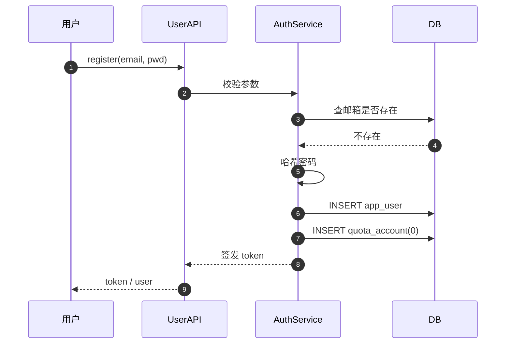
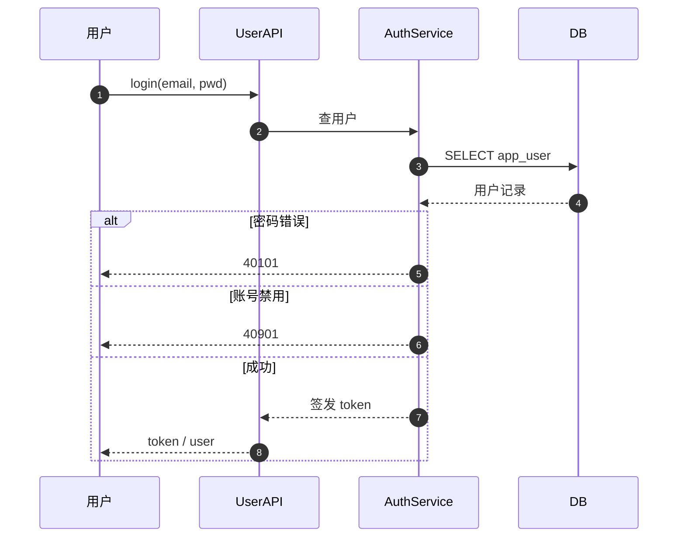
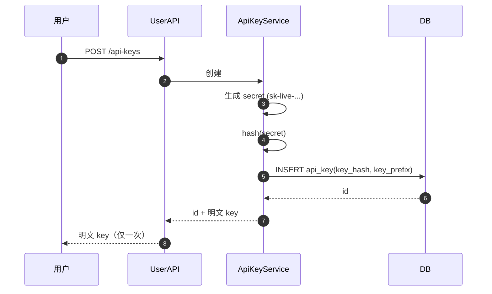
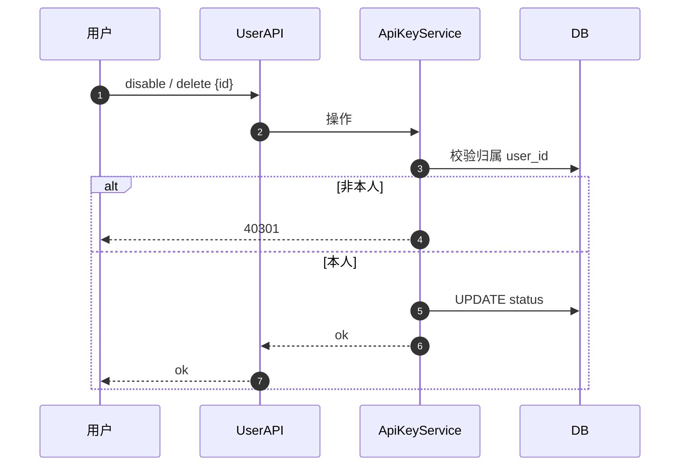
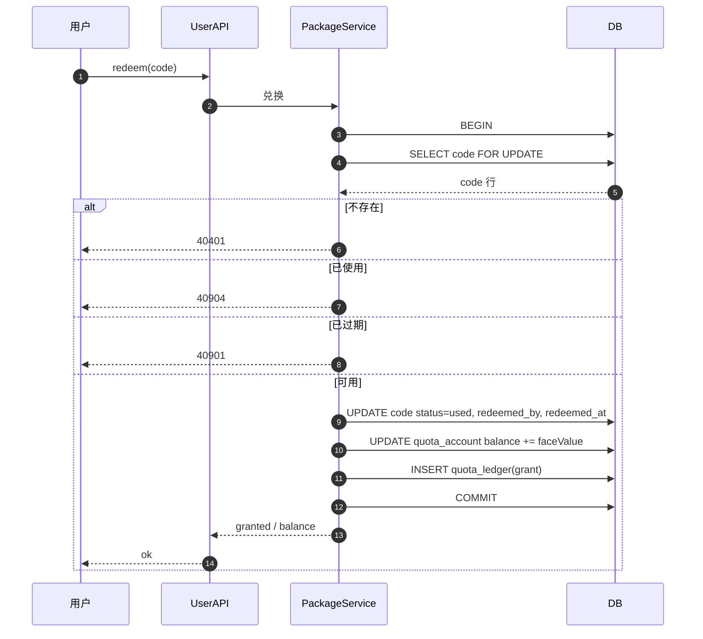
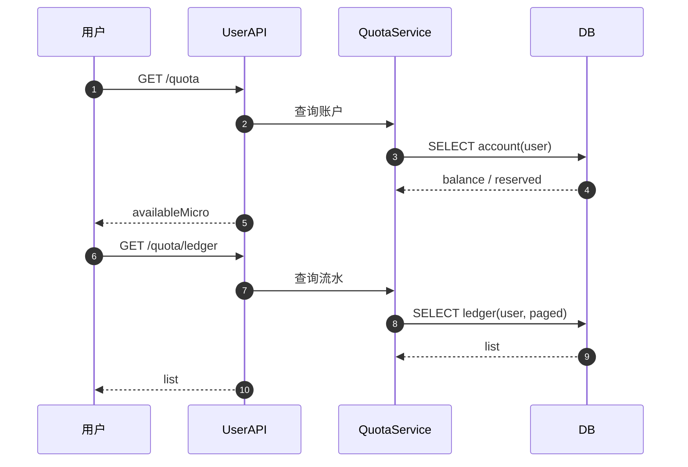
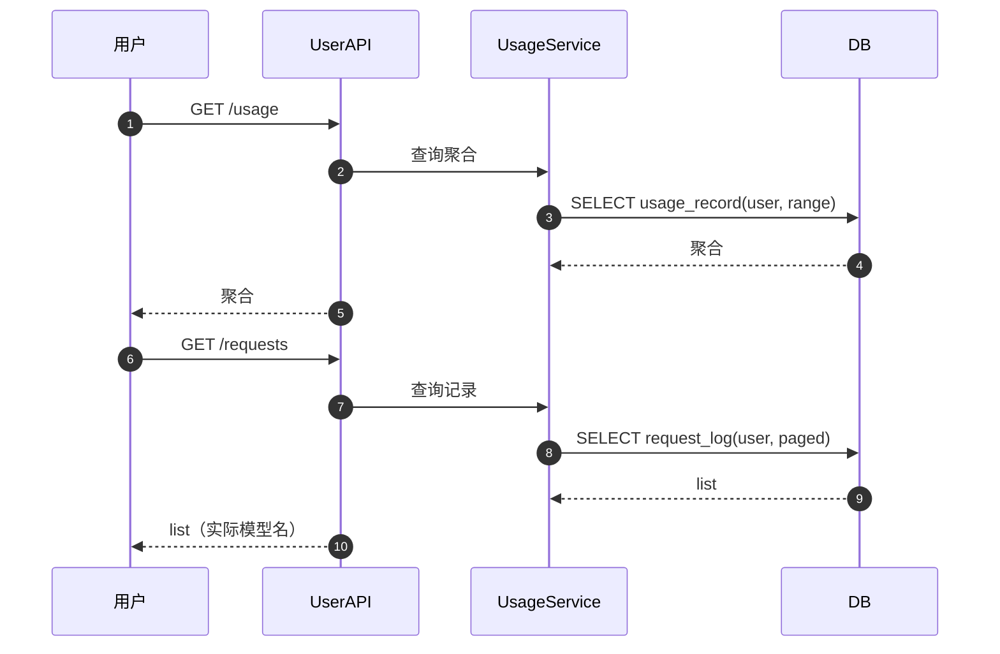
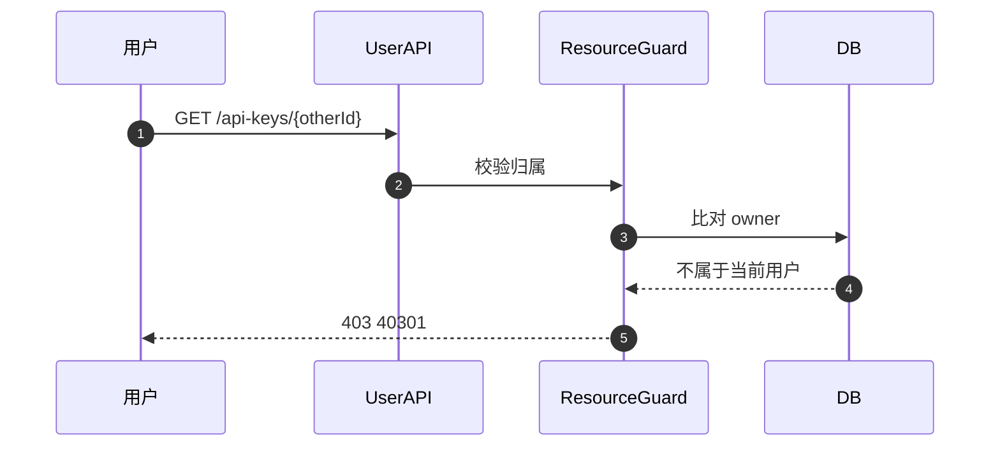
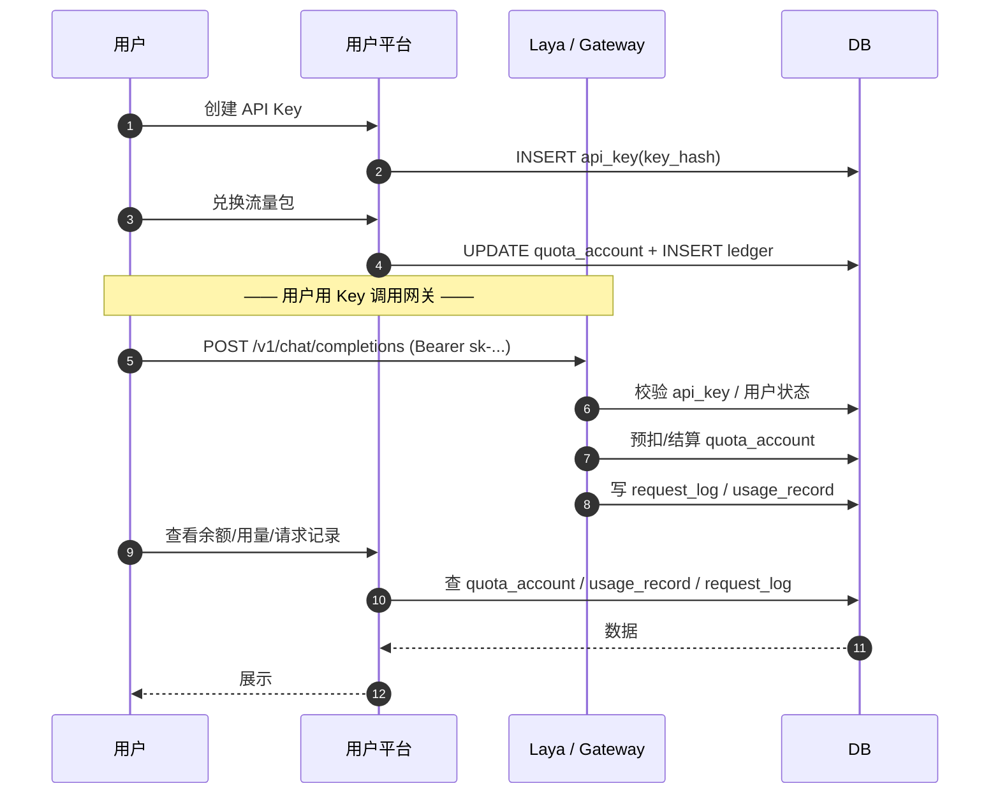

# 千丝傀智 · 用户平台 设计文档

| 项目 | 内容 |
|---|---|
| 平台 | 用户平台（用户端） |
| 入口前缀 | `/user/api/v1` |
| 文档版本 | v1.0 |
| 关联 | `docs/product-requirements.md` |

---

## 1. 整体设计

### 1.1 定位

用户平台面向终端用户，提供账户、API Key 管理、额度查看、流量包兑换、用量与请求记录查询。它不直接调用供应商，只负责账户与额度运营；实际调用发生在 OpenAI 兼容网关。

### 1.2 逻辑架构

```text
                      用户浏览器 / 客户端
                              |
                              v
+---------------------------------------------------------------+
|                      用户平台 (User Console)                   |
|  /user/api/v1/**                                               |
|  - 账户：注册 / 登录 / 我的信息                                |
|  - 凭证：API Key 创建 / 禁用 / 撤销                            |
|  - 额度：余额 / 流水                                           |
|  - 兑换：流量包兑换码                                          |
|  - 用量：用量统计 / 请求记录                                   |
+---------------------------------------------------------------+
                              |
        +---------------------+---------------------+
        v                     v                     v
+----------------+   +------------------+   +----------------+
| AuthService    |   | ApiKeyService    |   | QuotaService   |
+----------------+   +------------------+   +----------------+
        |                     |                     |
        +---------------------+---------------------+
                              v
+---------------------------------------------------------------+
|                        DB / Redis                              |
|  app_user  api_key  quota_account  quota_ledger               |
|  redemption_code  request_log  usage_record                   |
+---------------------------------------------------------------+
```

### 1.3 与网关、管理平台的关系

```text
管理平台  --创建流量包/兑换码-->  用户平台(用户兑换)
用户平台  --创建API Key--------->  用户用 Key 调用网关 /v1
网关      --写request_log/usage--> 用户平台展示用量
管理平台  --调整额度/启停用户---> 用户平台的状态随之变化
```

### 1.4 设计原则

- 用户只能访问自身资源，所有查询带 `user_id` 过滤。
- API Key 明文仅在创建时返回一次。
- 额度以微元整数存储，展示层格式化为元。
- 兑换码兑换在事务内完成，保证幂等。

---

## 2. 接口设计

统一前缀 `/user/api/v1`，鉴权：用户会话 Token（`Authorization: Bearer <token>`，注册/登录除外）。

统一响应包：

```json
{ "code": 0, "message": "ok", "data": {}, "requestId": "req_..." }
```

### 2.1 注册

```text
POST /user/api/v1/auth/register
```

参数：

| 参数 | 类型 | 必填 | 说明 |
|---|---|---|---|
| email | string | 是 | 邮箱 |
| password | string | 是 | 密码 |
| nickname | string | 否 | 昵称 |

返回：

```json
{
  "code": 0,
  "data": {
    "token": "eyJ...",
    "expiresIn": 86400,
    "user": { "id": 9, "email": "a@b.com", "nickname": "a" }
  }
}
```

错误：40001 / 40002 / 40902（邮箱已注册）

### 2.2 登录

```text
POST /user/api/v1/auth/login
```

参数：`email`、`password`。

返回：同注册（token + user）。
错误：40101（账号或密码错误）、40901（账号禁用）

### 2.3 我的信息

```text
GET /user/api/v1/me
```

返回：

```json
{ "code": 0, "data": { "id": 9, "email": "a@b.com", "nickname": "a", "status": "active", "createdAt": "..." } }
```

### 2.4 创建 API Key

```text
POST /user/api/v1/api-keys
```

参数：

| 参数 | 类型 | 必填 | 说明 |
|---|---|---|---|
| name | string | 是 | 名称 |
| expiresAt | string | 否 | 过期时间 |
| rateLimitPerMin | int | 否 | 每分钟限速 |

返回（**仅此一次返回明文 key**）：

```json
{
  "code": 0,
  "data": {
    "id": 21,
    "name": "coding-client",
    "key": "sk-live-ab12cd34ef56...",
    "keyPrefix": "sk-live-ab12",
    "status": "active",
    "createdAt": "..."
  }
}
```

错误：40001 / 40002

### 2.5 API Key 列表

```text
GET /user/api/v1/api-keys?page=1&pageSize=20
```

返回每项（**不含明文 key**）：`id/name/keyPrefix/status/expiresAt/lastUsedAt/createdAt`。

### 2.6 禁用 / 撤销 API Key

```text
POST   /user/api/v1/api-keys/{id}/disable
DELETE /user/api/v1/api-keys/{id}
```

- disable：状态置 `disabled`，可再启用。
- delete：状态置 `revoked` 并写入 `deleted_at`（软删除），不可恢复；软删后释放 `key_hash` 唯一索引。
- 仅能操作自身 Key，否则 40301。

### 2.7 我的额度

```text
GET /user/api/v1/quota
```

返回：

```json
{ "code": 0, "data": { "balanceMicro": 8000000, "reservedMicro": 10000, "availableMicro": 7990000 } }
```

### 2.8 额度流水

```text
GET /user/api/v1/quota/ledger?from=&to=&page=&pageSize=
```

返回每项：`id/type/amountMicro/balanceAfterMicro/remark/createdAt`。

### 2.9 兑换流量包

```text
POST /user/api/v1/redemption/redeem
```

参数：`code`（必填）。

返回：

```json
{ "code": 0, "data": { "grantedMicro": 5000000, "balanceMicro": 12990000 } }
```

错误：40401（码不存在）/ 40904（已兑换）/ 40901（已过期）/ 42902（额度相关异常）

### 2.10 用量统计

```text
GET /user/api/v1/usage?from=&to=
```

返回：

```json
{
  "code": 0,
  "data": {
    "requests": 120,
    "inputTokens": 50000,
    "outputTokens": 32000,
    "chargeMicro": 240000
  }
}
```

### 2.11 请求记录

```text
GET /user/api/v1/requests?page=&pageSize=&modelId=
```

返回每项：`requestId/model(实际模型名)/requestedModel/status/tokens/chargeMicro/latencyMs/createdAt`。

> 展示实际模型名；**不展示内部评分、候选排名、路由公式、低成本倾向值**。

---

## 3. 统一错误码

| 错误码 | 常量 | HTTP | 说明 |
|---|---|---|---|
| 0 | OK | 200 | 成功 |
| 40001 | INVALID_PARAM | 400 | 参数非法 |
| 40002 | MISSING_PARAM | 400 | 缺少必填参数 |
| 40101 | UNAUTHENTICATED | 401 | 未登录或凭证无效 |
| 40102 | TOKEN_EXPIRED | 401 | 凭证过期 |
| 40301 | FORBIDDEN | 403 | 无权限（越权访问他人资源） |
| 40401 | NOT_FOUND | 404 | 资源不存在（含兑换码） |
| 40404 | USER_NOT_FOUND | 404 | 用户不存在 |
| 40901 | STATE_CONFLICT | 409 | 状态冲突（禁用/已过期） |
| 40902 | DUPLICATE | 409 | 重复（邮箱、Key 名称约束） |
| 40904 | CODE_ALREADY_REDEEMED | 409 | 兑换码已使用 |
| 42901 | RATE_LIMITED | 429 | 触发限流 |
| 42902 | QUOTA_EXHAUSTED | 429 | 额度耗尽 |
| 50001 | INTERNAL_ERROR | 500 | 内部错误 |
| 50301 | SERVICE_UNAVAILABLE | 503 | 服务不可用 |

---

## 4. 表结构定义

### 4.1 用户平台依赖表

> 业务实体表使用 `deleted_at TIMESTAMPTZ` 软删除；唯一约束改为带 `WHERE deleted_at IS NULL` 的部分唯一索引。

```text
app_user         用户账户
api_key          API Key
quota_account    额度账户
quota_ledger     额度流水
quota_package    流量包（读取）
redemption_code  兑换码
request_log      请求记录（读取）
usage_record     用量统计（读取）
```

### 4.2 关键字段

#### app_user

| 字段 | 类型 | 说明 |
|---|---|---|
| id | bigserial | 主键 |
| email | varchar(191) | 唯一（部分唯一索引 WHERE deleted_at IS NULL） |
| password_hash | varchar(255) | 密码哈希 |
| nickname | varchar(128) | 昵称 |
| status | varchar(16) | active/disabled |
| created_at | timestamptz | |
| updated_at | timestamptz | |
| deleted_at | timestamptz | 软删除，NULL 表示未删除 |

#### api_key

| 字段 | 类型 | 说明 |
|---|---|---|
| id | bigserial | 主键 |
| user_id | bigint | 所属用户 |
| name | varchar(64) | 名称 |
| key_prefix | varchar(16) | 前缀 |
| key_hash | varchar(128) | 哈希（唯一） |
| status | varchar(16) | active/disabled/revoked |
| expires_at | timestamptz | |
| rate_limit_per_min | integer | |
| last_used_at | timestamptz | |
| created_at | timestamptz | |
| deleted_at | timestamptz | 软删除，NULL 表示未删除 |

#### quota_account

| 字段 | 类型 | 说明 |
|---|---|---|
| id | bigserial | 主键 |
| user_id | bigint | 唯一 |
| balance_micro | bigint | 余额 |
| reserved_micro | bigint | 冻结 |
| version | bigint | 乐观锁 |
| updated_at | timestamptz | |

#### quota_ledger

| 字段 | 类型 | 说明 |
|---|---|---|
| id | bigserial | 主键 |
| user_id | bigint | |
| type | varchar(24) | grant/consume/refund/adjust/reserve/release |
| amount_micro | bigint | 正负 |
| balance_after_micro | bigint | 变动后余额 |
| ref_type | varchar(24) | |
| ref_id | varchar(64) | |
| remark | varchar(255) | |
| created_at | timestamptz | |

#### redemption_code

| 字段 | 类型 | 说明 |
|---|---|---|
| id | bigserial | 主键 |
| batch_id | bigint | 批次 |
| package_id | bigint | 流量包 |
| code | varchar(64) | 唯一（部分唯一索引 WHERE deleted_at IS NULL） |
| status | varchar(16) | unused/used/expired |
| redeemed_by | bigint | 兑换用户 |
| redeemed_at | timestamptz | |
| expires_at | timestamptz | |
| created_at | timestamptz | |
| deleted_at | timestamptz | 软删除，NULL 表示未删除 |

---

## 5. 初始化 SQL

```sql
-- 用户平台依赖核心表（完整库结构见总设计文档）
CREATE TABLE app_user (
    id            BIGSERIAL PRIMARY KEY,
    email         VARCHAR(191) NOT NULL,
    password_hash VARCHAR(255) NOT NULL,
    nickname      VARCHAR(128) NOT NULL DEFAULT '',
    status        VARCHAR(16)  NOT NULL DEFAULT 'active',
    created_at    TIMESTAMPTZ  NOT NULL DEFAULT now(),
    updated_at    TIMESTAMPTZ  NOT NULL DEFAULT now(),
    deleted_at    TIMESTAMPTZ
);
CREATE UNIQUE INDEX uq_app_user_email ON app_user(email) WHERE deleted_at IS NULL;

CREATE TABLE api_key (
    id                  BIGSERIAL PRIMARY KEY,
    user_id             BIGINT NOT NULL REFERENCES app_user(id) ON DELETE CASCADE,
    name                VARCHAR(64)  NOT NULL DEFAULT 'default',
    key_prefix          VARCHAR(16)  NOT NULL,
    key_hash            VARCHAR(128) NOT NULL,
    status              VARCHAR(16)  NOT NULL DEFAULT 'active',
    expires_at          TIMESTAMPTZ,
    allowed_models      JSONB,
    rate_limit_per_min  INTEGER,
    last_used_at        TIMESTAMPTZ,
    created_at          TIMESTAMPTZ NOT NULL DEFAULT now(),
    deleted_at          TIMESTAMPTZ
);
CREATE UNIQUE INDEX uq_api_key_hash ON api_key(key_hash) WHERE deleted_at IS NULL;
CREATE INDEX idx_api_key_user ON api_key(user_id);

CREATE TABLE quota_account (
    id             BIGSERIAL PRIMARY KEY,
    user_id        BIGINT NOT NULL UNIQUE REFERENCES app_user(id) ON DELETE CASCADE,
    balance_micro  BIGINT NOT NULL DEFAULT 0,
    reserved_micro BIGINT NOT NULL DEFAULT 0,
    version        BIGINT NOT NULL DEFAULT 0,
    updated_at     TIMESTAMPTZ NOT NULL DEFAULT now(),
    CONSTRAINT chk_balance_nonneg CHECK (balance_micro >= 0),
    CONSTRAINT chk_reserved_nonneg CHECK (reserved_micro >= 0)
);

CREATE TABLE quota_ledger (
    id                  BIGSERIAL PRIMARY KEY,
    user_id             BIGINT NOT NULL,
    type                VARCHAR(24) NOT NULL,
    amount_micro        BIGINT NOT NULL,
    balance_after_micro BIGINT NOT NULL,
    ref_type            VARCHAR(24),
    ref_id              VARCHAR(64),
    remark              VARCHAR(255) NOT NULL DEFAULT '',
    created_at          TIMESTAMPTZ NOT NULL DEFAULT now()
);
CREATE INDEX idx_ledger_user_time ON quota_ledger(user_id, created_at);

CREATE TABLE redemption_code (
    id          BIGSERIAL PRIMARY KEY,
    batch_id    BIGINT NOT NULL,
    package_id  BIGINT NOT NULL,
    code        VARCHAR(64) NOT NULL,
    status      VARCHAR(16) NOT NULL DEFAULT 'unused',
    redeemed_by BIGINT REFERENCES app_user(id),
    redeemed_at TIMESTAMPTZ,
    expires_at  TIMESTAMPTZ,
    created_at  TIMESTAMPTZ NOT NULL DEFAULT now(),
    deleted_at  TIMESTAMPTZ
);
CREATE UNIQUE INDEX uq_redemption_code ON redemption_code(code) WHERE deleted_at IS NULL;
CREATE INDEX idx_code_status ON redemption_code(status);
```

---

## 6. 逐接口详细时序

> 时序图使用 Mermaid sequenceDiagram。

### 6.1 注册



### 6.2 登录



### 6.3 创建 API Key



### 6.4 禁用 / 撤销 API Key



### 6.5 兑换流量包



### 6.6 查看额度与流水



### 6.7 查看用量与请求记录



### 6.8 访问他人资源



---

## 7. 与 Laya 的账户/额度/用量交互

用户平台不调用 Laya，也不被 Laya 调用；两者通过共享数据库与缓存耦合。

### 7.1 用户平台提供给 Laya 的输入

| 用户平台数据 | 存储 | Laya 用途 |
|---|---|---|
| app_user.status | DB | 校验用户是否禁用 |
| api_key(key_hash/status/allowed_models/rate_limit) | DB | 鉴权、可用模型范围、限流 |
| quota_account(balance/reserved) | DB | 预扣与结算 |

### 7.2 Laya 回写给用户平台的产出

| Laya 产出 | 存储 | 用户平台用途 |
|---|---|---|
| request_log | DB | 用户查看“请求记录”（实际模型名/消耗/状态） |
| usage_record | DB | 用户查看“我的用量” |

### 7.3 交互时序



### 7.4 边界

- Laya 与用户平台无直接服务调用，仅共享 DB/Redis。
- 用户只能看到实际模型名，看不到内部评分、候选排名与路由策略。
- 额度预扣/结算由 Laya 在请求时执行，用户平台只负责展示与兑换。

---

## 8. 附录

### 8.1 安全

- 密码使用强哈希（如 argon2/bcrypt）。
- API Key 存哈希，比较用恒定时比较。
- 所有查询强制 `user_id` 过滤。
- 越权统一返回 40301，不泄露资源是否存在。

### 8.2 展示约定

- 额度单位微元，前端格式化为元（保留 2 位小数）。
- 时间显示本地时区，存储 UTC。
- 请求记录展示实际模型名；内部评分与策略不可见。
