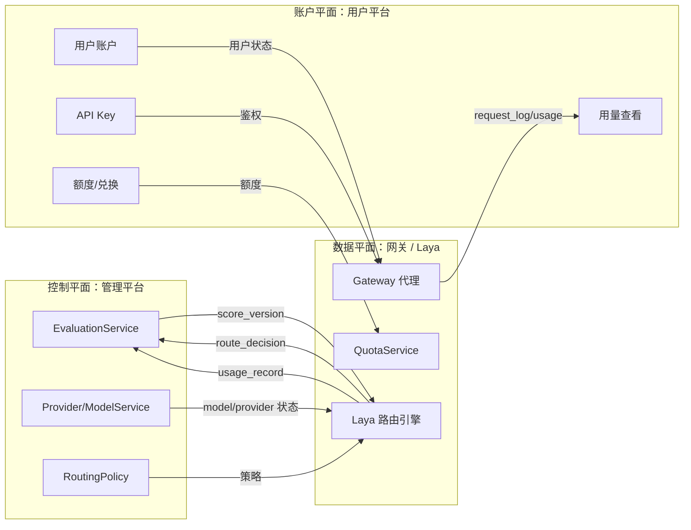
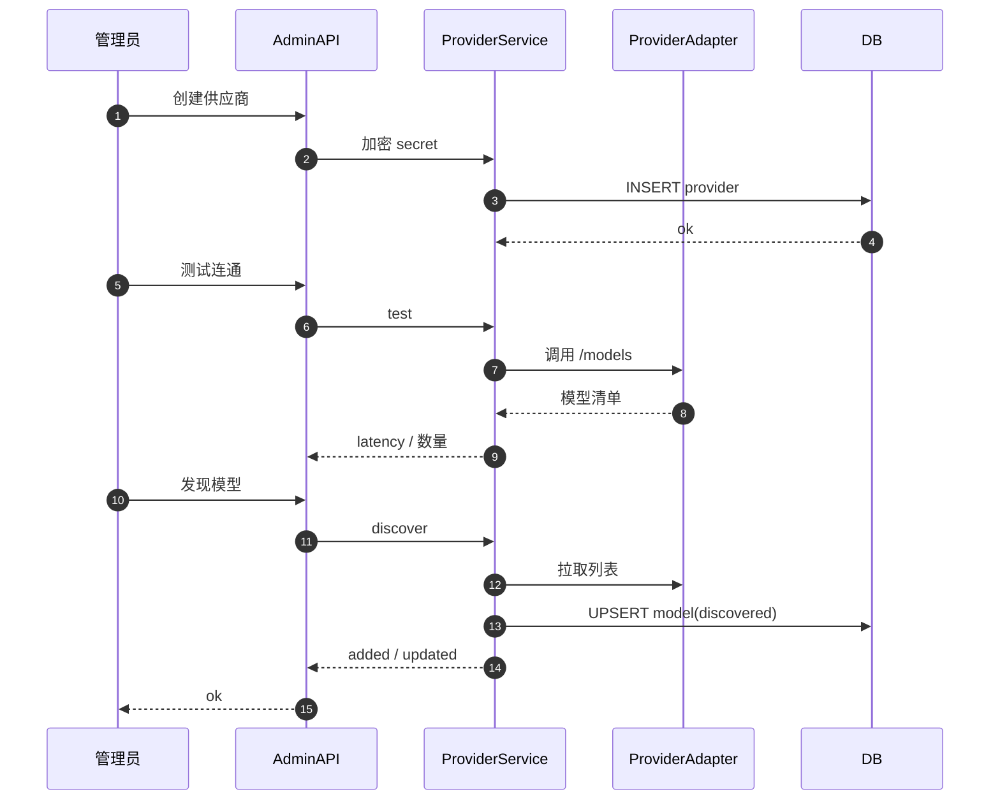
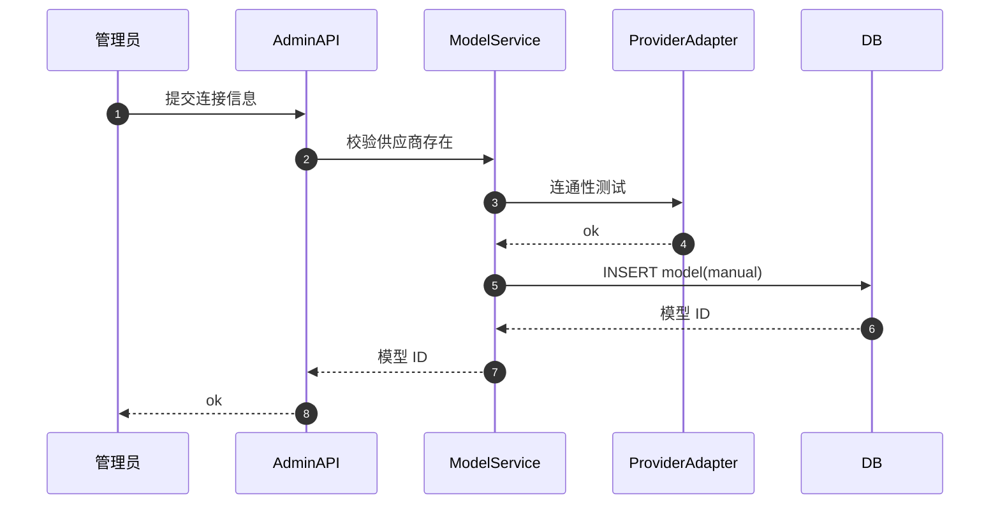
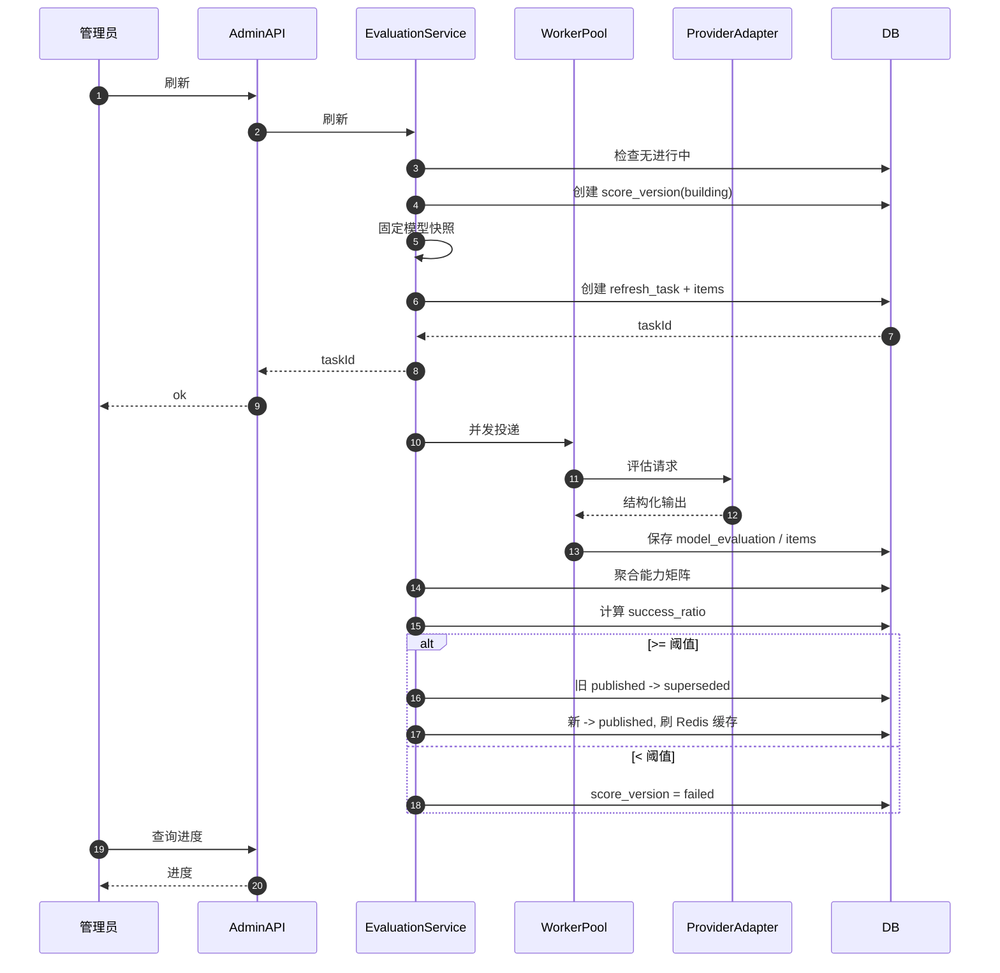
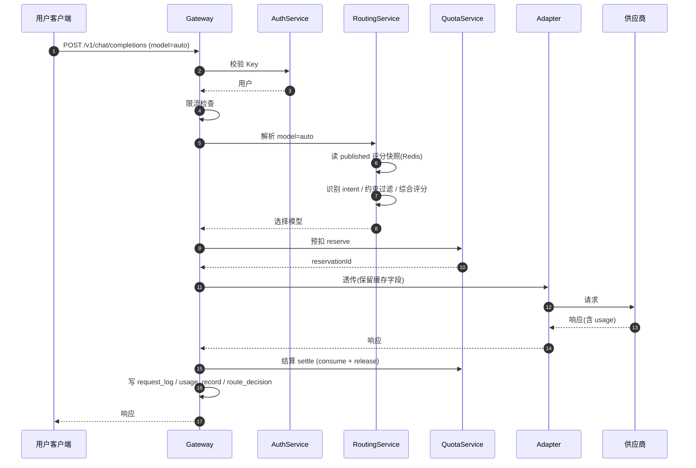
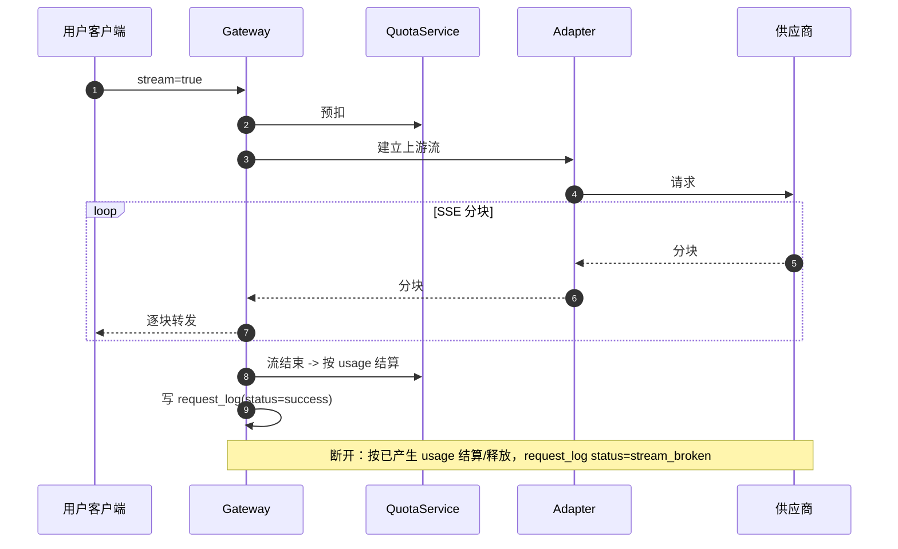
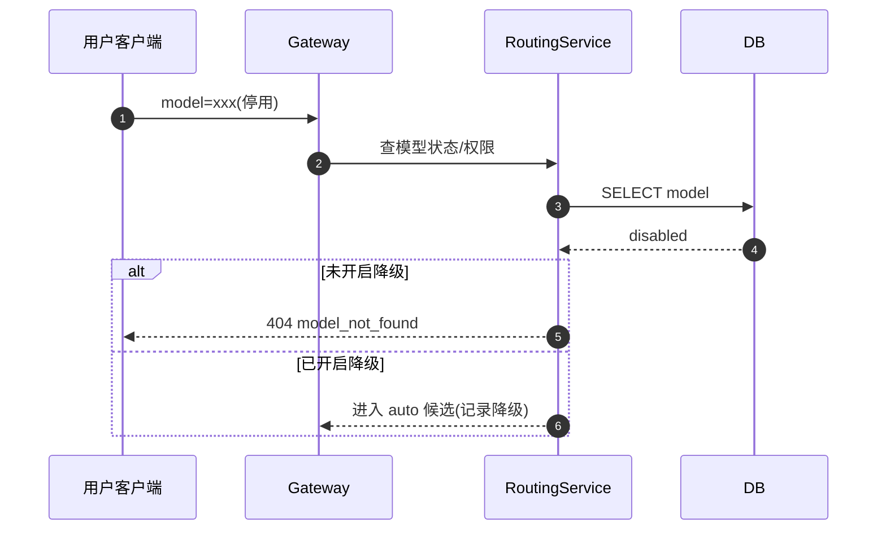
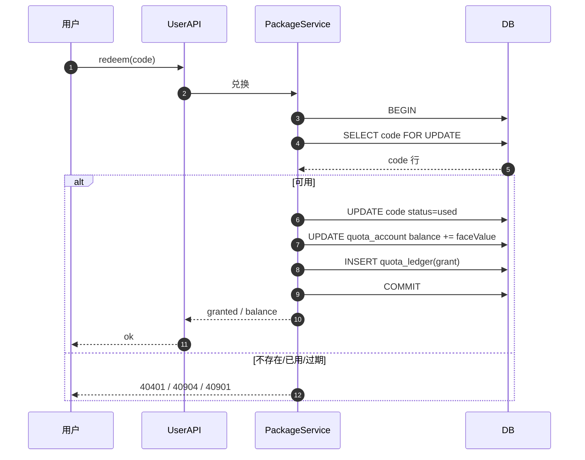
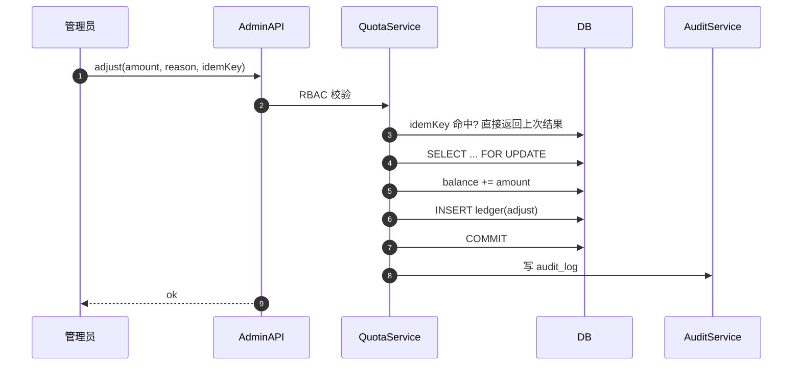

# 千丝傀智 · 多模型 AI 网关 详细设计文档（DDD）

| 项目 | 内容 |
|---|---|
| 产品名称 | 千丝傀智 |
| 文档类型 | 详细设计文档（Detailed Design） |
| 文档版本 | v1.0 |
| 关联文档 | `docs/product-requirements.md` |
| 关联变更 | `openspec/changes/build-multi-model-ai-gateway` |

> 本文档为设计文档，不包含实现代码，供研发按此落地。
> 文中 SQL 为初始化脚本，接口为契约定义，时序图为交互过程。

---

## 目录

1. 整体设计
2. 模块划分与职责
3. 统一约定（错误码、响应、分页、幂等）
4. 数据库表结构定义
5. 初始化 SQL
6. 接口设计（管理端）
7. 接口设计（用户端）
8. 接口设计（OpenAI 兼容网关）
9. 关键时序图
10. 附录：枚举与常量

---

## 1. 整体设计

### 1.1 技术选型假设（参考选型，可替换）

| 层 | 选型 | 说明 |
|---|---|---|
| 语言/框架 | 任意主流后端（如 Go / Java / Node.js） | 设计不绑定具体框架 |
| 主数据库 | PostgreSQL 14+ | 事务、账务、JSONB |
| 缓存/限流 | Redis 6+ | 评分快照缓存、限流、分布式锁 |
| 消息/任务 | Redis Stream 或独立队列 | 评分刷新异步任务 |
| 部署 | 无状态网关多实例 + 后台 worker | 网关可水平扩展 |

### 1.2 逻辑分层

```text
+---------------------------------------------------------------+
|                        接入层 (API Layer)                       |
|  /admin/api/**         /user/api/**         /v1/**             |
+---------------------------------------------------------------+
        |                    |                    |
        v                    v                    v
+---------------------------------------------------------------+
|                      应用服务层 (Service)                       |
|  ProviderService  ModelService  EvaluationService              |
|  RoutingService   GatewayService  QuotaService  UserService    |
+---------------------------------------------------------------+
        |                    |                    |
        v                    v                    v
+---------------------------------------------------------------+
|                     领域层 (Domain)                             |
|  路由策略  能力矩阵  额度账本  评分聚合  限流策略               |
+---------------------------------------------------------------+
        |                    |                    |
        v                    v                    v
+---------------------------------------------------------------+
|                   基础设施层 (Infrastructure)                   |
|  供应商适配器  存储(DB)  缓存(Redis)  队列  日志/审计           |
+---------------------------------------------------------------+
        |                    |                    |
        v                    v                    v
+----------------+  +----------------+  +----------------------+
|  供应商 A 适配  |  |  供应商 B 适配  |  |  供应商 N 适配        |
+----------------+  +----------------+  +----------------------+
```

### 1.3 数据平面与控制平面分离

```text
控制平面（低频、管理）              数据平面（高频、用户请求）
+------------------------+          +------------------------+
| 供应商/模型管理         |          | API Key 鉴权           |
| 评分刷新                |  发布    | 额度预扣/结算          |
| 用户/额度运营           | 评分版本 | 路由选择               |
| 流量包/兑换码           | -------> | 请求透明转发           |
+------------------------+          | 流式响应代理           |
        |                           | 用量/成本记录          |
        v                           +------------------------+
   后台 worker 并发评估
```

- 控制平面通过**评分版本**这一只读快照影响数据平面。
- 数据平面只读评分快照，绝不阻塞等待评估。
- 两者共用 DB，但用独立并发池与 Redis 键空间隔离。

### 1.4 评分版本机制（核心）

```text
        [score_version]
   V1 (published, 使用中)          V2 (candidate, 生成中)
        |                               |
        |<-- 用户请求始终读 V1 ----------|
        |                               |
        |                    评估并发完成 + 校验 + 阈值判定
        |                               |
        v                               v
   保持 published                    publish 原子切换
   status=published                 status=published
                                    V1 status=superseded
```

- `score_version.status`：`building` / `published` / `superseded` / `failed`。
- 全局只有一个 `published`；发布在事务内完成（旧版本置 superseded，新版本置 published）。
- 数据平面读取当前 `published` 版本的能力矩阵（带 Redis 缓存 + 短暂 TTL）。

### 1.5 请求生命周期（数据平面）

```text
请求 --> 网关接入 --> API Key 鉴权 --> 用户/Key 状态 --> 额度预扣
   --> 解析 model --> [auto: 路由选择 | 指定: 校验] --> 供应商适配转发
   --> 流式/非流式返回 --> 用量采集 --> 结算/释放 --> 记录日志
```

### 1.6 三方交互总览（Laya 为中心）

Laya 位于数据平面，但它同时被控制平面（管理平台）配置和观测，并与账户平面（用户平台）共享身份与额度数据。



| 方向 | 提供方 | 消费方 | 内容 |
|---|---|---|---|
| 配置 | 管理平台 | Laya | 评分快照、路由策略、模型/供应商状态 |
| 观测 | Laya | 管理平台 | route_decision、request_log、usage_record |
| 输入 | 用户平台 | Laya | 用户状态、API Key、额度账户 |
| 回写 | Laya | 用户平台 | request_log、usage_record |

关键结论：

- Laya **不调用**用户平台的服务接口，两者只共享数据库与缓存。
- 管理平台与 Laya 是**生产者/消费者关系**（评分快照与策略流入，观测数据流出）。
- 用户平台与 Laya 是**共享身份与账务的关系**（账户/额度流入，用量流出）。

---

## 2. 模块划分与职责

| 模块 | 职责 | 关键数据 |
|---|---|---|
| AuthService | 管理端/用户端登录、会话、RBAC | admin_user, role, app_user |
| ApiKeyService | 用户 API Key 创建、撤销、校验 | api_key |
| ProviderService | 供应商配置、连通性测试、密钥加密 | provider |
| ModelService | 模型发现、手动添加、元数据、状态 | model |
| EvaluationService | 评估快照、并发任务、评分聚合、版本发布 | model_evaluation, score_version, refresh_task |
| RoutingService | 意图识别、约束过滤、综合评分、选择模型 | 内存 + Redis 评分快照 |
| GatewayService | OpenAI 兼容、请求透传、流式、错误映射 | request_log |
| QuotaService | 额度账户、预扣、结算、返还、流水 | quota_account, quota_ledger |
| PackageService | 流量包、兑换码、兑换幂等 | quota_package, redemption_code |
| UsageService | 用量、成本、延迟、统计聚合 | usage_record |
| AuditService | 管理操作审计 | audit_log |
| ProviderAdapter | 各供应商协议转换、缓存字段保留 | 无（适配层） |

---

## 3. 统一约定

### 3.1 统一响应包（管理端 / 用户端）

```json
{
  "code": 0,
  "message": "ok",
  "data": {},
  "requestId": "req_01HX..."
}
```

- `code = 0` 表示成功；非 0 为业务错误码。
- HTTP 状态码与业务码分离：HTTP 表达传输层语义，`code` 表达业务语义。
- 分页统一：

```json
{
  "code": 0,
  "message": "ok",
  "data": {
    "list": [],
    "page": 1,
    "pageSize": 20,
    "total": 135
  },
  "requestId": "req_01HX..."
}
```

### 3.2 OpenAI 兼容错误格式（网关 /v1/**）

网关错误必须遵循 OpenAI 结构，便于客户端兼容：

```json
{
  "error": {
    "message": "The requested model does not exist.",
    "type": "invalid_request_error",
    "param": "model",
    "code": "model_not_found"
  }
}
```

### 3.3 统一错误码定义

#### 3.3.1 通用错误码（管理端/用户端 code 字段）

| 错误码 | 常量 | HTTP | 说明 |
|---|---|---|---|
| 0 | OK | 200 | 成功 |
| 40001 | INVALID_PARAM | 400 | 参数非法 |
| 40002 | MISSING_PARAM | 400 | 缺少必填参数 |
| 40003 | INVALID_FORMAT | 400 | 格式错误 |
| 40101 | UNAUTHENTICATED | 401 | 未登录或凭证无效 |
| 40102 | TOKEN_EXPIRED | 401 | 凭证过期 |
| 40301 | FORBIDDEN | 403 | 无权限 |
| 40302 | ROLE_DENIED | 403 | 角色权限不足 |
| 40401 | NOT_FOUND | 404 | 资源不存在 |
| 40402 | PROVIDER_NOT_FOUND | 404 | 供应商不存在 |
| 40403 | MODEL_NOT_FOUND | 404 | 模型不存在 |
| 40404 | USER_NOT_FOUND | 404 | 用户不存在 |
| 40405 | PACKAGE_NOT_FOUND | 404 | 流量包不存在 |
| 40901 | STATE_CONFLICT | 409 | 状态冲突 |
| 40902 | DUPLICATE | 409 | 重复创建 |
| 40903 | REFRESH_RUNNING | 409 | 已有刷新任务进行中 |
| 40904 | CODE_ALREADY_REDEEMED | 409 | 兑换码已使用 |
| 40905 | SCORE_VERSION_NOT_PUBLISHABLE | 409 | 评分版本不可发布 |
| 42901 | RATE_LIMITED | 429 | 触发限流 |
| 42902 | QUOTA_EXHAUSTED | 429 | 额度耗尽 |
| 50001 | INTERNAL_ERROR | 500 | 内部错误 |
| 50201 | PROVIDER_ERROR | 502 | 供应商错误 |
| 50202 | PROVIDER_TIMEOUT | 504 | 供应商超时 |
| 50301 | SERVICE_UNAVAILABLE | 503 | 服务不可用 |

#### 3.3.2 网关错误码（OpenAI 兼容 code 字段）

| OpenAI code | HTTP | type | 触发场景 |
|---|---|---|---|
| invalid_api_key | 401 | authentication_error | Key 无效/禁用/撤销 |
| insufficient_quota | 429 | insufficient_quota | 额度耗尽 |
| rate_limit_exceeded | 429 | rate_limit_error | 触发限流 |
| invalid_request_error | 400 | invalid_request_error | 请求参数错误 |
| model_not_found | 404 | invalid_request_error | 指定模型不存在/停用/无权限 |
| context_length_exceeded | 400 | invalid_request_error | 超出上下文限制 |
| upstream_error | 502 | api_error | 供应商返回错误 |
| upstream_timeout | 504 | api_error | 供应商超时 |

### 3.4 幂等约定

- 写操作支持 `Idempotency-Key` 请求头（兑换、创建订单类）。
- 兑换码兑换以 `code` 唯一约束 + 状态机保证幂等。
- 评分发布用乐观锁（版本号 / 状态条件更新）。

### 3.5 鉴权约定

| 入口 | 凭证 | 说明 |
|---|---|---|
| /admin/api/** | 管理员会话 Token | RBAC 校验权限点 |
| /user/api/** | 用户会话 Token | 仅能访问自身资源 |
| /v1/** | `Authorization: Bearer sk-xxx` | 用户 API Key |

### 3.6 时间与金额约定

- 时间统一 UTC 存储，接口返回 RFC3339。
- 额度内部以整数微元（1e-6 元）存储，字段后缀 `_micro`。
- 展示层格式化为元（2 位小数）。

### 3.7 软删除约定

- 业务实体表统一使用 `deleted_at TIMESTAMPTZ` 作为软删除标记，`deleted_at IS NULL` 表示未删除。
- 软删除表的唯一键改为**部分唯一索引**（`... WHERE deleted_at IS NULL`），避免已删除记录占用唯一值、阻碍重新创建。
- 需要软删除的表：`admin_user`、`role`、`app_user`、`api_key`、`provider`、`model`、`quota_package`、`redemption_code_batch`、`redemption_code`。
- 追加型/账务/日志表不软删除（保持不可变或全量留痕）：`quota_ledger`、`request_log`、`usage_record`、`route_decision`、`model_evaluation`、`model_capability`、`score_version`、`refresh_task`、`refresh_task_item`、`audit_log`、`admin_user_role`。
- 查询默认过滤 `deleted_at IS NULL`；管理端可显式查询已删除记录。
- 历史数据不物理删除；“删除”操作即写入 `deleted_at`。

---

## 4. 数据库表结构定义

### 4.1 表清单

```text
# 身份与权限
admin_user              管理员
role                    角色
admin_user_role         管理员-角色
app_user                终端用户

# 凭证
api_key                 用户 API Key

# 供应商与模型
provider                供应商
model                   模型
model_capability        模型能力评分（按评分版本）
model_evaluation        模型评估原始记录

# 评分
score_version           评分版本
refresh_task            评分刷新任务
refresh_task_item       刷新任务明细

# 运行时
route_decision          路由决策记录
request_log             请求日志
usage_record            用量记录

# 额度与账务
quota_account           额度账户
quota_ledger            额度流水
quota_package           流量包
redemption_code_batch   兑换码批次
redemption_code         兑换码

# 策略与审计
routing_policy          路由策略
audit_log               审计日志
```

### 4.2 关键表字段说明

#### 4.2.1 provider（供应商）

| 字段 | 类型 | 说明 |
|---|---|---|
| id | bigserial | 主键 |
| name | varchar(128) | 供应商名称 |
| type | varchar(32) | 类型：openai_compatible / custom |
| base_url | varchar(512) | API Base URL |
| auth_type | varchar(32) | 认证方式：bearer / custom |
| secret_cipher | text | 加密后的密钥 |
| protocol | varchar(32) | 协议类型 |
| region | varchar(64) | 区域 |
| status | varchar(16) | enabled / disabled |
| created_at | timestamptz | |
| updated_at | timestamptz | |
| deleted_at | timestamptz | 软删除，NULL 表示未删除 |

#### 4.2.2 model（模型）

| 字段 | 类型 | 说明 |
|---|---|---|
| id | bigserial | 主键 |
| provider_id | bigint | 所属供应商 |
| name | varchar(128) | 模型展示名 |
| model_key | varchar(128) | 模型标识（供应商侧） |
| context_length | integer | 上下文长度 |
| input_modalities | jsonb | 支持输入类型 |
| supports_stream | boolean | 是否支持流式 |
| supports_tools | boolean | 是否支持工具调用 |
| input_price_micro | bigint | 输入单价（微元/token） |
| output_price_micro | bigint | 输出单价（微元/token） |
| source | varchar(16) | discovered / manual |
| status | varchar(16) | discovering/evaluating/available/unavailable/disabled/eval_failed |
| created_at | timestamptz | |
| updated_at | timestamptz | |
| deleted_at | timestamptz | 软删除，NULL 表示未删除 |

部分唯一索引（联合唯一 + 软删条件）：`(provider_id, model_key) WHERE deleted_at IS NULL`

#### 4.2.3 score_version（评分版本）

| 字段 | 类型 | 说明 |
|---|---|---|
| id | bigserial | 主键 |
| status | varchar(16) | building / published / superseded / failed |
| success_ratio | numeric(5,4) | 本次有效覆盖率 |
| total_models | integer | 参与模型数 |
| valid_models | integer | 有效评分模型数 |
| template_version | varchar(32) | 模板版本 |
| rule_version | varchar(32) | 规则版本 |
| created_at | timestamptz | |
| published_at | timestamptz | |

#### 4.2.4 model_capability（能力评分）

| 字段 | 类型 | 说明 |
|---|---|---|
| id | bigserial | 主键 |
| score_version_id | bigint | 评分版本 |
| model_id | bigint | 模型 |
| dimension | varchar(32) | 维度：coding/reasoning/... |
| score | numeric(5,4) | 综合分 |
| self_score | numeric(5,4) | 自评 |
| peer_score | numeric(5,4) | 互评 |
| confidence | numeric(5,4) | 置信度 |

唯一约束：`(score_version_id, model_id, dimension)`

#### 4.2.5 model_evaluation（评估原始记录）

| 字段 | 类型 | 说明 |
|---|---|---|
| id | bigserial | 主键 |
| refresh_task_id | bigint | 刷新任务 |
| evaluator_model_id | bigint | 评估者 |
| target_model_id | bigint | 被评估者 |
| dimension | varchar(32) | 维度 |
| score | numeric(5,4) | 分数 |
| confidence | numeric(5,4) | 置信度 |
| advantages | jsonb | 优势 |
| disadvantages | jsonb | 劣势 |
| recommended_tasks | jsonb | 适用任务 |
| not_recommended_tasks | jsonb | 不适用任务 |
| raw_output | jsonb | 原始输出 |
| weight | numeric(5,4) | 计算权重 |
| created_at | timestamptz | |

#### 4.2.6 refresh_task / refresh_task_item

refresh_task：

| 字段 | 类型 | 说明 |
|---|---|---|
| id | bigserial | 主键 |
| score_version_id | bigint | 目标评分版本 |
| status | varchar(16) | running/published/failed/cancelled |
| total | integer | 任务总数 |
| succeeded | integer | 成功数 |
| failed | integer | 失败数 |
| created_by | bigint | 触发管理员 |
| created_at | timestamptz | |
| finished_at | timestamptz | |

refresh_task_item：

| 字段 | 类型 | 说明 |
|---|---|---|
| id | bigserial | 主键 |
| task_id | bigint | 所属任务 |
| model_id | bigint | 评估者模型 |
| status | varchar(24) | pending/running/succeeded/timeout/rate_limited/invalid_output/unavailable/cancelled |
| error_message | text | 错误信息 |
| started_at | timestamptz | |
| finished_at | timestamptz | |

#### 4.2.7 api_key（用户 API Key）

| 字段 | 类型 | 说明 |
|---|---|---|
| id | bigserial | 主键 |
| user_id | bigint | 所属用户 |
| name | varchar(64) | 名称 |
| key_prefix | varchar(16) | 前缀 |
| key_hash | varchar(128) | 哈希 |
| status | varchar(16) | active/disabled/revoked |
| expires_at | timestamptz | 过期时间 |
| allowed_models | jsonb | 允许模型范围 |
| rate_limit_per_min | integer | 每分钟限速 |
| last_used_at | timestamptz | |
| created_at | timestamptz | |
| deleted_at | timestamptz | 软删除，NULL 表示未删除 |

部分唯一索引（软删条件）：`key_hash WHERE deleted_at IS NULL`

#### 4.2.8 quota_account / quota_ledger

quota_account：

| 字段 | 类型 | 说明 |
|---|---|---|
| id | bigserial | 主键 |
| user_id | bigint | 唯一 |
| balance_micro | bigint | 可用余额（微元） |
| reserved_micro | bigint | 预扣冻结 |
| version | bigint | 乐观锁版本 |
| updated_at | timestamptz | |

quota_ledger（不可变流水）：

| 字段 | 类型 | 说明 |
|---|---|---|
| id | bigserial | 主键 |
| user_id | bigint | |
| type | varchar(24) | grant/consume/refund/adjust/reserve/release |
| amount_micro | bigint | 正负 |
| balance_after_micro | bigint | 变动后余额 |
| ref_type | varchar(24) | 关联类型：request/redemption/admin |
| ref_id | varchar(64) | 关联 ID |
| remark | varchar(255) | |
| created_at | timestamptz | |

#### 4.2.9 quota_package / redemption_code

quota_package：

| 字段 | 类型 | 说明 |
|---|---|---|
| id | bigserial | 主键 |
| name | varchar(128) | 名称 |
| face_value_micro | bigint | 额度面值 |
| valid_days | integer | 有效期天数 |
| model_scope | jsonb | 适用模型范围 |
| allow_auto_route | boolean | 是否允许自动路由 |
| status | varchar(16) | active/disabled |
| created_at | timestamptz | |
| deleted_at | timestamptz | 软删除，NULL 表示未删除 |

redemption_code：

| 字段 | 类型 | 说明 |
|---|---|---|
| id | bigserial | 主键 |
| batch_id | bigint | 批次 |
| package_id | bigint | 流量包 |
| code | varchar(64) | 兑换码，唯一 |
| status | varchar(16) | unused/used/expired |
| redeemed_by | bigint | 兑换用户 |
| redeemed_at | timestamptz | |
| expires_at | timestamptz | |
| created_at | timestamptz | |
| deleted_at | timestamptz | 软删除，NULL 表示未删除 |

部分唯一索引（软删条件）：`code WHERE deleted_at IS NULL`

#### 4.2.10 request_log / usage_record

request_log：

| 字段 | 类型 | 说明 |
|---|---|---|
| id | bigserial | 主键 |
| request_id | varchar(64) | 唯一请求 ID |
| user_id | bigint | |
| api_key_id | bigint | |
| model_id | bigint | 实际使用模型 |
| requested_model | varchar(64) | 请求模型（auto 或指定） |
| status | varchar(16) | success/error/stream_broken |
| error_code | varchar(64) | |
| input_tokens | integer | |
| output_tokens | integer | |
| cost_micro | bigint | 供应商成本 |
| charge_micro | bigint | 用户扣费 |
| latency_ms | integer | |
| created_at | timestamptz | |

usage_record（聚合用，可与 request_log 合一，视量级拆分）：

| 字段 | 类型 | 说明 |
|---|---|---|
| id | bigserial | |
| user_id | bigint | |
| model_id | bigint | |
| provider_id | bigint | |
| request_count | integer | |
| input_tokens | bigint | |
| output_tokens | bigint | |
| cost_micro | bigint | |
| charge_micro | bigint | |
| stat_date | date | 统计日期 |
| stat_hour | smallint | 统计小时 |

#### 4.2.11 routing_policy（路由策略）

| 字段 | 类型 | 说明 |
|---|---|---|
| id | bigserial | 主键 |
| low_capability_bias | integer | 低成本/低能力倾向 0-100 |
| min_publish_ratio | numeric(5,4) | 最低发布成功率，默认 0.80 |
| high_risk_force_quality | boolean | 高风险任务强制质量优先 |
| eval_max_tokens | integer | 评估 max_tokens，默认 2000 |
| eval_concurrency | integer | 评估并发，默认 5 |
| eval_timeout_seconds | integer | 评估超时，默认 60 |
| content_log_enabled | boolean | 是否记录内容，默认 false |
| content_log_retention_days | integer | 内容日志保留，默认 7 |
| updated_by | bigint | |
| updated_at | timestamptz | |

#### 4.2.12 audit_log（审计日志）

| 字段 | 类型 | 说明 |
|---|---|---|
| id | bigserial | 主键 |
| actor_type | varchar(16) | admin/user/system |
| actor_id | bigint | |
| action | varchar(64) | 操作 |
| target_type | varchar(32) | 对象类型 |
| target_id | varchar(64) | 对象 ID |
| detail | jsonb | 详情（脱敏） |
| ip | varchar(64) | |
| created_at | timestamptz | |

---

## 5. 初始化 SQL

> 方言：PostgreSQL 14+。`gen_random_uuid()` 需 `pgcrypto`。

```sql
-- =====================================================================
-- 千丝傀智 · 初始化脚本
-- =====================================================================

CREATE EXTENSION IF NOT EXISTS pgcrypto;

-- ---------------------------------------------------------------------
-- 1. 身份与权限
-- ---------------------------------------------------------------------
CREATE TABLE admin_user (
    id            BIGSERIAL PRIMARY KEY,
    username      VARCHAR(64)  NOT NULL,
    display_name  VARCHAR(128) NOT NULL DEFAULT '',
    password_hash VARCHAR(255) NOT NULL,
    status        VARCHAR(16)  NOT NULL DEFAULT 'active', -- active/disabled
    created_at    TIMESTAMPTZ  NOT NULL DEFAULT now(),
    updated_at    TIMESTAMPTZ  NOT NULL DEFAULT now(),
    deleted_at    TIMESTAMPTZ
);
CREATE UNIQUE INDEX uq_admin_user_username
    ON admin_user(username) WHERE deleted_at IS NULL;

CREATE TABLE role (
    id          BIGSERIAL PRIMARY KEY,
    code        VARCHAR(64) NOT NULL, -- super_admin/model_admin/user_admin/quota_admin/auditor
    name        VARCHAR(128) NOT NULL,
    permissions JSONB NOT NULL DEFAULT '[]'::jsonb,
    created_at  TIMESTAMPTZ NOT NULL DEFAULT now(),
    deleted_at  TIMESTAMPTZ
);
CREATE UNIQUE INDEX uq_role_code ON role(code) WHERE deleted_at IS NULL;

CREATE TABLE admin_user_role (
    id            BIGSERIAL PRIMARY KEY,
    admin_user_id BIGINT NOT NULL REFERENCES admin_user(id) ON DELETE CASCADE,
    role_id       BIGINT NOT NULL REFERENCES role(id) ON DELETE CASCADE,
    UNIQUE (admin_user_id, role_id)
);

CREATE TABLE app_user (
    id            BIGSERIAL PRIMARY KEY,
    email         VARCHAR(191) NOT NULL,
    password_hash VARCHAR(255) NOT NULL,
    nickname      VARCHAR(128) NOT NULL DEFAULT '',
    status        VARCHAR(16)  NOT NULL DEFAULT 'active', -- active/disabled
    created_at    TIMESTAMPTZ  NOT NULL DEFAULT now(),
    updated_at    TIMESTAMPTZ  NOT NULL DEFAULT now(),
    deleted_at    TIMESTAMPTZ
);
CREATE UNIQUE INDEX uq_app_user_email ON app_user(email) WHERE deleted_at IS NULL;

-- ---------------------------------------------------------------------
-- 2. 凭证
-- ---------------------------------------------------------------------
CREATE TABLE api_key (
    id                  BIGSERIAL PRIMARY KEY,
    user_id             BIGINT NOT NULL REFERENCES app_user(id) ON DELETE CASCADE,
    name                VARCHAR(64)  NOT NULL DEFAULT 'default',
    key_prefix          VARCHAR(16)  NOT NULL,
    key_hash            VARCHAR(128) NOT NULL,
    status              VARCHAR(16)  NOT NULL DEFAULT 'active', -- active/disabled/revoked
    expires_at          TIMESTAMPTZ,
    allowed_models      JSONB,
    rate_limit_per_min  INTEGER,
    last_used_at        TIMESTAMPTZ,
    created_at          TIMESTAMPTZ NOT NULL DEFAULT now(),
    deleted_at          TIMESTAMPTZ
);
CREATE UNIQUE INDEX uq_api_key_hash ON api_key(key_hash) WHERE deleted_at IS NULL;
CREATE INDEX idx_api_key_user ON api_key(user_id);

-- ---------------------------------------------------------------------
-- 3. 供应商与模型
-- ---------------------------------------------------------------------
CREATE TABLE provider (
    id            BIGSERIAL PRIMARY KEY,
    name          VARCHAR(128) NOT NULL,
    type          VARCHAR(32)  NOT NULL DEFAULT 'openai_compatible',
    base_url      VARCHAR(512) NOT NULL,
    auth_type     VARCHAR(32)  NOT NULL DEFAULT 'bearer',
    secret_cipher TEXT,
    protocol      VARCHAR(32)  NOT NULL DEFAULT 'openai',
    region        VARCHAR(64)  NOT NULL DEFAULT '',
    status        VARCHAR(16)  NOT NULL DEFAULT 'enabled', -- enabled/disabled
    created_at    TIMESTAMPTZ  NOT NULL DEFAULT now(),
    updated_at    TIMESTAMPTZ  NOT NULL DEFAULT now(),
    deleted_at    TIMESTAMPTZ
);

CREATE TABLE model (
    id                BIGSERIAL PRIMARY KEY,
    provider_id       BIGINT NOT NULL REFERENCES provider(id) ON DELETE CASCADE,
    name              VARCHAR(128) NOT NULL,
    model_key         VARCHAR(128) NOT NULL,
    context_length    INTEGER,
    input_modalities  JSONB NOT NULL DEFAULT '["text"]'::jsonb,
    supports_stream   BOOLEAN NOT NULL DEFAULT true,
    supports_tools    BOOLEAN NOT NULL DEFAULT false,
    input_price_micro  BIGINT NOT NULL DEFAULT 0,
    output_price_micro BIGINT NOT NULL DEFAULT 0,
    source            VARCHAR(16) NOT NULL DEFAULT 'manual', -- discovered/manual
    status            VARCHAR(16) NOT NULL DEFAULT 'available',
    created_at        TIMESTAMPTZ NOT NULL DEFAULT now(),
    updated_at        TIMESTAMPTZ NOT NULL DEFAULT now(),
    deleted_at        TIMESTAMPTZ
);
CREATE UNIQUE INDEX uq_model_provider_key
    ON model(provider_id, model_key) WHERE deleted_at IS NULL;
CREATE INDEX idx_model_status ON model(status);

-- ---------------------------------------------------------------------
-- 4. 评分
-- ---------------------------------------------------------------------
CREATE TABLE score_version (
    id               BIGSERIAL PRIMARY KEY,
    status           VARCHAR(16) NOT NULL DEFAULT 'building', -- building/published/superseded/failed
    success_ratio    NUMERIC(5,4) NOT NULL DEFAULT 0,
    total_models     INTEGER NOT NULL DEFAULT 0,
    valid_models     INTEGER NOT NULL DEFAULT 0,
    template_version VARCHAR(32) NOT NULL DEFAULT 'v1',
    rule_version     VARCHAR(32) NOT NULL DEFAULT 'v1',
    created_at       TIMESTAMPTZ NOT NULL DEFAULT now(),
    published_at     TIMESTAMPTZ
);
CREATE UNIQUE INDEX uq_score_version_published
    ON score_version((status)) WHERE status = 'published';

CREATE TABLE model_capability (
    id               BIGSERIAL PRIMARY KEY,
    score_version_id BIGINT NOT NULL REFERENCES score_version(id) ON DELETE CASCADE,
    model_id         BIGINT NOT NULL REFERENCES model(id) ON DELETE CASCADE,
    dimension        VARCHAR(32) NOT NULL,
    score            NUMERIC(5,4) NOT NULL DEFAULT 0,
    self_score       NUMERIC(5,4) NOT NULL DEFAULT 0,
    peer_score       NUMERIC(5,4) NOT NULL DEFAULT 0,
    confidence       NUMERIC(5,4) NOT NULL DEFAULT 0,
    UNIQUE (score_version_id, model_id, dimension)
);

CREATE TABLE model_evaluation (
    id                BIGSERIAL PRIMARY KEY,
    refresh_task_id   BIGINT,
    evaluator_model_id BIGINT NOT NULL REFERENCES model(id) ON DELETE CASCADE,
    target_model_id   BIGINT NOT NULL REFERENCES model(id) ON DELETE CASCADE,
    dimension         VARCHAR(32) NOT NULL,
    score             NUMERIC(5,4) NOT NULL DEFAULT 0,
    confidence        NUMERIC(5,4) NOT NULL DEFAULT 0,
    advantages        JSONB,
    disadvantages     JSONB,
    recommended_tasks JSONB,
    not_recommended_tasks JSONB,
    raw_output        JSONB,
    weight            NUMERIC(5,4) NOT NULL DEFAULT 0,
    created_at        TIMESTAMPTZ NOT NULL DEFAULT now()
);
CREATE INDEX idx_eval_task ON model_evaluation(refresh_task_id);

CREATE TABLE refresh_task (
    id               BIGSERIAL PRIMARY KEY,
    score_version_id BIGINT REFERENCES score_version(id),
    status           VARCHAR(16) NOT NULL DEFAULT 'running', -- running/published/failed/cancelled
    total            INTEGER NOT NULL DEFAULT 0,
    succeeded        INTEGER NOT NULL DEFAULT 0,
    failed           INTEGER NOT NULL DEFAULT 0,
    created_by       BIGINT REFERENCES admin_user(id),
    created_at       TIMESTAMPTZ NOT NULL DEFAULT now(),
    finished_at      TIMESTAMPTZ
);

CREATE TABLE refresh_task_item (
    id            BIGSERIAL PRIMARY KEY,
    task_id       BIGINT NOT NULL REFERENCES refresh_task(id) ON DELETE CASCADE,
    model_id      BIGINT NOT NULL REFERENCES model(id) ON DELETE CASCADE,
    status        VARCHAR(24) NOT NULL DEFAULT 'pending',
    error_message TEXT,
    started_at    TIMESTAMPTZ,
    finished_at   TIMESTAMPTZ
);
CREATE INDEX idx_refresh_item_task ON refresh_task_item(task_id);

-- ---------------------------------------------------------------------
-- 5. 运行时
-- ---------------------------------------------------------------------
CREATE TABLE route_decision (
    id            BIGSERIAL PRIMARY KEY,
    request_id    VARCHAR(64) NOT NULL,
    intent        VARCHAR(64),
    selected_model_id BIGINT,
    score_version_id  BIGINT,
    candidates    JSONB,
    policy_snapshot JSONB,
    created_at    TIMESTAMPTZ NOT NULL DEFAULT now()
);
CREATE INDEX idx_route_request ON route_decision(request_id);

CREATE TABLE request_log (
    id              BIGSERIAL PRIMARY KEY,
    request_id      VARCHAR(64) NOT NULL UNIQUE,
    user_id         BIGINT,
    api_key_id      BIGINT,
    model_id        BIGINT,
    requested_model VARCHAR(64),
    status          VARCHAR(16) NOT NULL, -- success/error/stream_broken
    error_code      VARCHAR(64),
    input_tokens    INTEGER NOT NULL DEFAULT 0,
    output_tokens   INTEGER NOT NULL DEFAULT 0,
    cost_micro      BIGINT  NOT NULL DEFAULT 0,
    charge_micro    BIGINT  NOT NULL DEFAULT 0,
    latency_ms      INTEGER NOT NULL DEFAULT 0,
    created_at      TIMESTAMPTZ NOT NULL DEFAULT now()
);
CREATE INDEX idx_req_user_time ON request_log(user_id, created_at);
CREATE INDEX idx_req_model_time ON request_log(model_id, created_at);

CREATE TABLE usage_record (
    id            BIGSERIAL PRIMARY KEY,
    user_id       BIGINT NOT NULL,
    model_id      BIGINT NOT NULL,
    provider_id   BIGINT NOT NULL,
    request_count BIGINT NOT NULL DEFAULT 0,
    input_tokens  BIGINT NOT NULL DEFAULT 0,
    output_tokens BIGINT NOT NULL DEFAULT 0,
    cost_micro    BIGINT NOT NULL DEFAULT 0,
    charge_micro  BIGINT NOT NULL DEFAULT 0,
    stat_date     DATE NOT NULL,
    stat_hour     SMALLINT NOT NULL DEFAULT 0,
    UNIQUE (user_id, model_id, stat_date, stat_hour)
);

-- ---------------------------------------------------------------------
-- 6. 额度与账务
-- ---------------------------------------------------------------------
CREATE TABLE quota_account (
    id             BIGSERIAL PRIMARY KEY,
    user_id        BIGINT NOT NULL UNIQUE REFERENCES app_user(id) ON DELETE CASCADE,
    balance_micro  BIGINT NOT NULL DEFAULT 0,
    reserved_micro BIGINT NOT NULL DEFAULT 0,
    version        BIGINT NOT NULL DEFAULT 0,
    updated_at     TIMESTAMPTZ NOT NULL DEFAULT now(),
    CONSTRAINT chk_balance_nonneg CHECK (balance_micro >= 0),
    CONSTRAINT chk_reserved_nonneg CHECK (reserved_micro >= 0)
);

CREATE TABLE quota_ledger (
    id                  BIGSERIAL PRIMARY KEY,
    user_id             BIGINT NOT NULL,
    type                VARCHAR(24) NOT NULL, -- grant/consume/refund/adjust/reserve/release
    amount_micro        BIGINT NOT NULL,
    balance_after_micro BIGINT NOT NULL,
    ref_type            VARCHAR(24),
    ref_id              VARCHAR(64),
    remark              VARCHAR(255) NOT NULL DEFAULT '',
    created_at          TIMESTAMPTZ NOT NULL DEFAULT now()
);
CREATE INDEX idx_ledger_user_time ON quota_ledger(user_id, created_at);

CREATE TABLE quota_package (
    id               BIGSERIAL PRIMARY KEY,
    name             VARCHAR(128) NOT NULL,
    face_value_micro BIGINT NOT NULL,
    valid_days       INTEGER,
    model_scope      JSONB,
    allow_auto_route BOOLEAN NOT NULL DEFAULT true,
    status           VARCHAR(16) NOT NULL DEFAULT 'active',
    created_at       TIMESTAMPTZ NOT NULL DEFAULT now(),
    deleted_at       TIMESTAMPTZ
);

CREATE TABLE redemption_code_batch (
    id         BIGSERIAL PRIMARY KEY,
    package_id BIGINT NOT NULL REFERENCES quota_package(id),
    quantity   INTEGER NOT NULL,
    created_by BIGINT REFERENCES admin_user(id),
    remark     VARCHAR(255) NOT NULL DEFAULT '',
    created_at TIMESTAMPTZ NOT NULL DEFAULT now(),
    deleted_at TIMESTAMPTZ
);

CREATE TABLE redemption_code (
    id          BIGSERIAL PRIMARY KEY,
    batch_id    BIGINT NOT NULL REFERENCES redemption_code_batch(id) ON DELETE CASCADE,
    package_id  BIGINT NOT NULL REFERENCES quota_package(id),
    code        VARCHAR(64) NOT NULL,
    status      VARCHAR(16) NOT NULL DEFAULT 'unused', -- unused/used/expired
    redeemed_by BIGINT REFERENCES app_user(id),
    redeemed_at TIMESTAMPTZ,
    expires_at  TIMESTAMPTZ,
    created_at  TIMESTAMPTZ NOT NULL DEFAULT now(),
    deleted_at  TIMESTAMPTZ
);
CREATE UNIQUE INDEX uq_redemption_code ON redemption_code(code) WHERE deleted_at IS NULL;
CREATE INDEX idx_code_status ON redemption_code(status);

-- ---------------------------------------------------------------------
-- 7. 策略与审计
-- ---------------------------------------------------------------------
CREATE TABLE routing_policy (
    id                     BIGSERIAL PRIMARY KEY,
    low_capability_bias    INTEGER NOT NULL DEFAULT 50,
    min_publish_ratio      NUMERIC(5,4) NOT NULL DEFAULT 0.80,
    high_risk_force_quality BOOLEAN NOT NULL DEFAULT true,
    eval_max_tokens        INTEGER NOT NULL DEFAULT 2000,
    eval_concurrency       INTEGER NOT NULL DEFAULT 5,
    eval_timeout_seconds   INTEGER NOT NULL DEFAULT 60,
    content_log_enabled    BOOLEAN NOT NULL DEFAULT false,
    content_log_retention_days INTEGER NOT NULL DEFAULT 7,
    updated_by             BIGINT REFERENCES admin_user(id),
    updated_at             TIMESTAMPTZ NOT NULL DEFAULT now()
);

CREATE TABLE audit_log (
    id          BIGSERIAL PRIMARY KEY,
    actor_type  VARCHAR(16) NOT NULL,
    actor_id    BIGINT,
    action      VARCHAR(64) NOT NULL,
    target_type VARCHAR(32),
    target_id   VARCHAR(64),
    detail      JSONB,
    ip          VARCHAR(64),
    created_at  TIMESTAMPTZ NOT NULL DEFAULT now()
);
CREATE INDEX idx_audit_time ON audit_log(created_at);

-- ---------------------------------------------------------------------
-- 8. 初始化数据
-- ---------------------------------------------------------------------
INSERT INTO role (code, name, permissions) VALUES
 ('super_admin','超级管理员','["*"]'),
 ('model_admin','模型管理员','["provider:*","model:*","evaluation:*"]'),
 ('user_admin','用户管理员','["user:*","apikey:*"]'),
 ('quota_admin','额度管理员','["quota:*","package:*","code:*"]'),
 ('auditor','审计员','["log:read","usage:read","audit:read"]');

INSERT INTO routing_policy (id) VALUES (1);
```

---

## 6. 接口设计（管理端）

统一前缀：`/admin/api/v1`，鉴权：管理员会话 Token + RBAC。

### 6.1 供应商

#### 6.1.1 创建供应商

```text
POST /admin/api/v1/providers
权限：provider:create
```

请求参数：

| 参数 | 类型 | 必填 | 说明 |
|---|---|---|---|
| name | string | 是 | 供应商名称 |
| type | string | 是 | openai_compatible / custom |
| baseUrl | string | 是 | API Base URL |
| authType | string | 是 | bearer / custom |
| secret | string | 是 | 密钥（明文传输，服务端加密） |
| protocol | string | 否 | 默认 openai |
| region | string | 否 | 区域 |

返回：

```json
{
  "code": 0,
  "message": "ok",
  "data": {
    "id": 12,
    "name": "DeepSeek",
    "type": "openai_compatible",
    "baseUrl": "https://api.deepseek.com/v1",
    "secretMasked": "sk-****abcd",
    "status": "enabled",
    "createdAt": "2025-01-01T00:00:00Z"
  },
  "requestId": "req_01HX..."
}
```

错误：40001 / 40002 / 40302 / 40902

#### 6.1.2 供应商列表

```text
GET /admin/api/v1/providers?page=1&pageSize=20&keyword=&status=
```

返回分页 `list`，每项含 `id/name/type/baseUrl/status/modelCount/createdAt`。

#### 6.1.3 供应商详情 / 更新 / 删除

```text
GET    /admin/api/v1/providers/{id}
PUT    /admin/api/v1/providers/{id}
DELETE /admin/api/v1/providers/{id}
```

- 更新时 `secret` 为空表示不修改。
- 删除前校验是否仍有可用模型；有则 40901。

#### 6.1.4 连通性测试

```text
POST /admin/api/v1/providers/{id}/test
```

返回：

```json
{ "code": 0, "data": { "reachable": true, "latencyMs": 320, "modelsDetected": 8 } }
```

错误：40402 / 50201 / 50202

#### 6.1.5 触发模型发现

```text
POST /admin/api/v1/providers/{id}/discover
```

返回：

```json
{ "code": 0, "data": { "discovered": 8, "added": 5, "updated": 2, "unavailable": 1 } }
```

### 6.2 模型

#### 6.2.1 模型列表

```text
GET /admin/api/v1/models?providerId=&status=&keyword=&page=1&pageSize=20
```

每项含 `id/providerId/name/modelKey/status/source/contextLength/price/score(current)`。

#### 6.2.2 手动添加模型

```text
POST /admin/api/v1/models
```

| 参数 | 类型 | 必填 |
|---|---|---|
| providerId | long | 是 |
| name | string | 是 |
| modelKey | string | 是 |
| contextLength | int | 否 |
| inputModalities | string[] | 否 |
| supportsStream | bool | 否 |
| supportsTools | bool | 否 |
| inputPriceMicro | long | 否 |
| outputPriceMicro | long | 否 |

错误：40402 / 40902（同供应商下 modelKey 重复）

#### 6.2.3 模型详情 / 更新 / 启停

```text
GET  /admin/api/v1/models/{id}
PUT  /admin/api/v1/models/{id}
POST /admin/api/v1/models/{id}/enable
POST /admin/api/v1/models/{id}/disable
```

#### 6.2.4 查看模型能力画像

```text
GET /admin/api/v1/models/{id}/capabilities
```

返回：

```json
{
  "code": 0,
  "data": {
    "modelId": 3,
    "scoreVersionId": 7,
    "dimensions": [
      { "dimension": "coding", "score": 0.88, "selfScore": 0.9, "peerScore": 0.85, "confidence": 0.72 }
    ],
    "advantages": ["代码分析较强"],
    "disadvantages": ["情感闲聊一般"]
  }
}
```

### 6.3 评分刷新

#### 6.3.1 触发刷新

```text
POST /admin/api/v1/evaluation/refresh
权限：evaluation:refresh
```

返回：

```json
{ "code": 0, "data": { "taskId": 1001, "scoreVersionId": 8, "status": "running", "total": 40 } }
```

错误：40903（已有任务进行中）、40302

#### 6.3.2 刷新任务进度

```text
GET /admin/api/v1/evaluation/refresh/{taskId}
```

返回：

```json
{
  "code": 0,
  "data": {
    "taskId": 1001,
    "status": "running",
    "total": 40, "succeeded": 37, "failed": 2, "pending": 1,
    "items": [ { "modelId": 3, "status": "succeeded" }, { "modelId": 4, "status": "timeout" } ]
  }
}
```

#### 6.3.3 评分版本列表 / 发布 / 回滚

```text
GET  /admin/api/v1/evaluation/versions
POST /admin/api/v1/evaluation/versions/{id}/publish
POST /admin/api/v1/evaluation/versions/{id}/rollback
```

- 发布校验：`successRatio >= minPublishRatio`，否则 40905。
- 发布/回滚在事务内原子切换，旧 `published` 置 `superseded`。

### 6.4 用户与额度运营

#### 6.4.1 用户列表 / 详情 / 启停

```text
GET  /admin/api/v1/users?keyword=&status=&page=&pageSize=
GET  /admin/api/v1/users/{id}
POST /admin/api/v1/users/{id}/disable
POST /admin/api/v1/users/{id}/enable
```

#### 6.4.2 调整用户额度

```text
POST /admin/api/v1/users/{id}/quota/adjust
权限：quota:adjust
```

| 参数 | 类型 | 必填 | 说明 |
|---|---|---|---|
| amountMicro | long | 是 | 正负均可 |
| remark | string | 否 | 备注 |
| idempotencyKey | string | 否 | 幂等键 |

返回：调整后余额。

错误：40302 / 40404 / 40001

#### 6.4.3 用量统计

```text
GET /admin/api/v1/usage/models?from=&to=&providerId=&modelId=
GET /admin/api/v1/usage/users?from=&to=&userId=
GET /admin/api/v1/usage/cost?from=&to=&groupBy=model|user|provider
```

返回示例：

```json
{
  "code": 0,
  "data": {
    "list": [
      { "modelId": 3, "requests": 1200, "inputTokens": 500000, "outputTokens": 320000,
        "costMicro": 1200000, "chargeMicro": 2400000, "successRate": 0.998, "avgLatencyMs": 840 }
    ]
  }
}
```

### 6.5 流量包与兑换码

#### 6.5.1 创建流量包

```text
POST /admin/api/v1/quota-packages
```

| 参数 | 类型 | 必填 |
|---|---|---|
| name | string | 是 |
| faceValueMicro | long | 是 |
| validDays | int | 否 |
| modelScope | string[] | 否 |
| allowAutoRoute | bool | 否 |

#### 6.5.2 批量生成兑换码

```text
POST /admin/api/v1/quota-packages/{id}/codes
权限：code:generate
```

| 参数 | 类型 | 必填 | 说明 |
|---|---|---|---|
| quantity | int | 是 | 生成数量，上限可配置 |
| expiresAt | string | 否 | 统一过期时间 |
| remark | string | 否 | |

返回：

```json
{ "code": 0, "data": { "batchId": 55, "quantity": 100, "codes": ["QZ-XXXX-0001"] } }
```

错误：40405 / 40001 / 40302

#### 6.5.3 兑换码列表

```text
GET /admin/api/v1/redemption-codes?batchId=&status=&page=
```

### 6.6 路由策略

#### 6.6.1 读取 / 更新路由策略

```text
GET /admin/api/v1/routing-policy
PUT /admin/api/v1/routing-policy
权限：policy:update
```

| 参数 | 类型 | 范围 |
|---|---|---|
| lowCapabilityBias | int | 0-100 |
| minPublishRatio | number | 0-1 |
| highRiskForceQuality | bool | |
| evalMaxTokens | int | |
| evalConcurrency | int | |
| contentLogEnabled | bool | |
| contentLogRetentionDays | int | |

### 6.7 审计日志

```text
GET /admin/api/v1/audit-logs?actorType=&action=&from=&to=&page=
```

---

## 7. 接口设计（用户端）

统一前缀：`/user/api/v1`，鉴权：用户会话 Token。

### 7.1 注册

```text
POST /user/api/v1/auth/register
```

| 参数 | 类型 | 必填 |
|---|---|---|
| email | string | 是 |
| password | string | 是 |
| nickname | string | 否 |

返回：用户信息 + Token。
错误：40001 / 40902（邮箱已注册）

### 7.2 登录

```text
POST /user/api/v1/auth/login
```

返回：

```json
{ "code": 0, "data": { "token": "eyJ...", "expiresIn": 86400, "user": { "id": 9, "email": "a@b.com" } } }
```

错误：40101

### 7.3 当前用户

```text
GET /user/api/v1/me
```

### 7.4 API Key

#### 7.4.1 创建

```text
POST /user/api/v1/api-keys
```

| 参数 | 类型 | 必填 |
|---|---|---|
| name | string | 是 |
| expiresAt | string | 否 |
| rateLimitPerMin | int | 否 |

返回（**仅此一次返回明文密钥**）：

```json
{
  "code": 0,
  "data": {
    "id": 21,
    "name": "coding-client",
    "key": "sk-live-ab12cd34ef56...",
    "keyPrefix": "sk-live-ab12",
    "status": "active"
  }
}
```

#### 7.4.2 列表 / 禁用 / 撤销

```text
GET    /user/api/v1/api-keys
POST   /user/api/v1/api-keys/{id}/disable
DELETE /user/api/v1/api-keys/{id}
```

### 7.5 额度

```text
GET /user/api/v1/quota
```

返回：

```json
{ "code": 0, "data": { "balanceMicro": 8000000, "reservedMicro": 10000, "availableMicro": 7990000 } }
```

```text
GET /user/api/v1/quota/ledger?from=&to=&page=
```

### 7.6 兑换流量包

```text
POST /user/api/v1/redemption/redeem
```

| 参数 | 类型 | 必填 |
|---|---|---|
| code | string | 是 |

返回：

```json
{ "code": 0, "data": { "grantedMicro": 5000000, "balanceMicro": 12990000 } }
```

错误：40401（码不存在）/ 40904（已兑换）/ 40901（已过期）/ 42902

### 7.7 用量与请求记录

```text
GET /user/api/v1/usage?from=&to=
GET /user/api/v1/requests?page=&pageSize=&modelId=
```

请求记录每项含 `requestId/model/status/tokens/charge/latency/createdAt`（**展示实际模型名，不展示内部评分**）。

---

## 8. 接口设计（OpenAI 兼容网关）

前缀：`/v1`，鉴权：`Authorization: Bearer sk-xxx`。

> Laya 路由引擎的完整设计（意图识别、评分快照、约束过滤、综合评分、低能力倾向、降级、可观测性）见 `docs/design-openai-gateway.md` 第 2 章。

### 8.1 模型列表

```text
GET /v1/models
```

返回（OpenAI 兼容）：

```json
{
  "object": "list",
  "data": [
    { "id": "auto", "object": "model", "owned_by": "qiansi" },
    { "id": "deepseek-chat", "object": "model", "owned_by": "deepseek" }
  ]
}
```

- `auto` 为虚拟模型，触发智能路由。
- 其余为该 API Key 有权访问且状态可用的模型。

### 8.2 聊天补全

```text
POST /v1/chat/completions
Content-Type: application/json
Authorization: Bearer sk-xxx
```

请求参数（关键字段）：

| 参数 | 类型 | 必填 | 说明 |
|---|---|---|---|
| model | string | 是 | `auto` 或具体模型 ID |
| messages | array | 是 | OpenAI 消息数组 |
| stream | bool | 否 | 是否流式 |
| temperature | number | 否 | 透传 |
| tools | array | 否 | 工具调用，透传 |
| 其他 | - | 否 | 供应商支持的字段尽量透传 |

非流式返回：标准 OpenAI `chat.completion` 对象，`model` 字段为**实际使用的模型**。

流式返回：`text/event-stream`，逐块 `data:`，以 `data: [DONE]` 结束。

错误：遵循 3.2 与 3.3.2。

### 8.3 网关内部处理顺序

```text
1. 校验 Authorization 格式
2. 查 api_key(key_hash) 与状态/过期
3. 校验用户状态
4. 校验 Key 限流、用户限流、全局限流
5. 解析 model
6. auto  -> RoutingService 选择模型
   specified -> 校验模型启用/权限/范围
7. QuotaService 预扣
8. ProviderAdapter 透传（保留缓存字段与消息顺序）
9. 采集用量（流式结束时统计）
10. 结算/释放，写 request_log / usage_record / route_decision
```

---

## 9. 关键时序图

> 时序图使用 Mermaid sequenceDiagram（GitHub / GitLab / VS Code 可直接渲染）。

### 9.1 供应商接入与模型发现



### 9.2 手动添加模型



### 9.3 评分刷新



### 9.4 自动路由调用（非流式）



### 9.5 流式调用



### 9.6 指定模型不可用



### 9.7 兑换流量包



### 9.8 额度预扣与结算

```mermaid
sequenceDiagram
    autonumber
    participant G as Gateway
    participant Q as QuotaService
    participant DB as DB
    participant U as 供应商
    G->>Q: reserve(est)
    Q->>DB: SELECT account FOR UPDATE
    alt 可用不足
        Q-->>G: 42902
    else 足够
        Q->>DB: balance -= est; reserved += est
        Q->>DB: INSERT ledger(reserve)
        Q->>DB: COMMIT
        Q-->>G: reservationId
        G->>U: 调用供应商
        U-->>G: usage
        G->>Q: settle(actual)
        Q->>DB: reserved -= est
        Q->>DB: consumed = min(actual, est)
        Q->>DB: refund = est - consumed; balance += refund
        Q->>DB: INSERT ledger(consume) + ledger(release/refund)
        Q->>DB: COMMIT
    end
```

### 9.9 管理端调整额度



---

## 10. 附录：枚举与常量

### 10.1 状态枚举

```text
provider.status            : enabled / disabled
model.status               : discovering / evaluating / available / unavailable / disabled / eval_failed
model.source               : discovered / manual
score_version.status       : building / published / superseded / failed
refresh_task.status        : running / published / failed / cancelled
refresh_task_item.status   : pending / running / succeeded / timeout / rate_limited / invalid_output / unavailable / cancelled
api_key.status             : active / disabled / revoked
redemption_code.status     : unused / used / expired
quota_ledger.type          : grant / consume / refund / adjust / reserve / release
request_log.status         : success / error / stream_broken
```

### 10.2 能力维度常量

```text
coding, reasoning, writing, translation, summarization,
casual_chat, emotional_support, vision, tool_calling, structured_output
```

### 10.3 默认参数常量（对应 PRD 第 10 章）

```text
low_capability_bias        = 50
min_publish_ratio          = 0.80
eval_max_tokens            = 2000
eval_concurrency           = 5
eval_timeout_seconds       = 60
content_log_enabled        = false
content_log_retention_days = 7
额度单位                    = 微元 (1e-6 元)
```

### 10.4 分页默认值

```text
page     = 1
pageSize = 20
maxSize  = 100
```

---

## 文档结束

本设计文档覆盖：整体设计、模块划分、统一错误码、表结构、初始化 SQL、管理端/用户端/网关接口契约以及关键时序。实现阶段以本文档为接口与数据结构依据，行为验收以 OpenSpec 变更 spec 为准。
